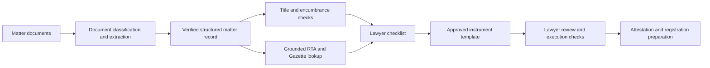

# Registration of Title Act Notes

This directory contains legal sources, training material, process maps,
checklists, prescribed forms, and sample notarial instruments concerning Sri
Lanka's Registration of Title Act, No. 21 of 1998 (RTA).

The collection supports Draftly's first conveyancing prototype: an RTA-first
notarial workbench for examination of title, drafting, execution, and
attestation. It also contains material relevant to stamping and registration.

## Important Use Boundaries

- The Act and official Gazettes are the primary legal authorities in this
  collection.
- Presentations, flowcharts, and checklists are explanatory working material.
  They must not be cited as legal authority without checking the relevant Act,
  regulation, Gazette, or other official source.
- Sample instruments contain private personal and property information. Do not
  publish them or use their names, identity numbers, addresses, signatures, or
  transaction details in demonstrations, evaluation data, or model training.
- Anonymize and obtain lawyer approval before converting a sample instrument
  into a reusable template.
- Some samples contain blank fields or details that may have been carried over
  from an earlier document. They are examples of document structure, not
  verified model instruments.

## Collection Summary

| Category | Files | Primary use |
| --- | ---: | --- |
| Primary legal sources | 3 | Statutory rules, regulations, and prescribed forms |
| Presentations | 3 | RTA instruction and practical notarial workflow |
| Process maps | 8 | Visual models of registration procedures |
| Checklists and clauses | 2 | Required-document checks and attestation structure |
| Sample transfer instruments | 3 | Field discovery and template analysis |
| Scanned prescribed form | 1 | Sinhala OCR and field-identification work |
| **Total** | **20** | |

## Authority and Reliability

| Level | Material | How Draftly should use it |
| --- | --- | --- |
| Primary authority | RTA and official Gazettes | Legal retrieval, rule validation, section citations, and form verification |
| Derived legal guidance | Presentations and process maps | Workflow design and candidate rules that must be checked against primary authority |
| Practice material | Checklist and local-authority presentation | Intake requirements, missing-document checks, and lawyer-review prompts |
| Private examples | Transfer and gift-related instruments | Schema design and anonymized template research only |

## Primary Legal Sources

### `registration-of-title-act-no-21-of-1998.pdf`

Registration of Title Act, No. 21 of 1998. The PDF is readable and contains 75
sections. Its main structure is:

| Part | Sections | Subject |
| --- | --- | --- |
| Preliminary and administration | 1-9 | Application of the Act, officers, and administrative institutions |
| Initial compilation of title | 10-33 | Cadastral mapping, notices, claims, investigations, declarations, schedules, title classes, and registration |
| Inspection and certified copies | 34-35 | Inspection of the title register and cadastral map and obtaining copies |
| Subdivision and amalgamation | 36-37 | Changes to registered parcels and title certificates |
| Transactions | 38-49 | Instruments, notarial duties, execution, filing, refusal, and effect of registration |
| Strata titles | 50-52 | Horizontal subdivision and condominium-related registration |
| Retention of instruments | 53 | Retention of registered instruments |
| Transmission of title | 54-56 | Testate and intestate transmission |
| General provisions | 57-75 | Prescription, rectification, indemnity, partition, offences, regulations, and interpretation |

Use this PDF as the first authority for section-level RTA questions. Gazette
amendments and later legislation must also be checked where applicable.

### `gazette-extraordinary-1886-58-2014-si.pdf`

Gazette Extraordinary No. 1886/58 of 31 October 2014. It contains amendments
to the RTA regulations and substituted schedules or forms.

The PDF uses a legacy Sinhala font encoding. Ordinary PDF text extraction
produces garbled Latin characters, so its Sinhala text is not yet reliable for
automated section or field extraction. The document has been visually and
structurally inspected, but it requires font mapping or OCR before line-level
content is added to Draftly's processed corpus.

### `gazette-extraordinary-2308-27-2022.pdf`

Gazette Extraordinary No. 2308/27 of 1 December 2022. These regulations were
made under section 67 of the RTA and further amend the 1998 regulations and
2014 amendments. The PDF is readable and includes detailed prescribed forms.

Observed subjects include:

- particulars required for property sections;
- publication of determinations under section 14;
- forms for referring disputes to the District Court;
- notarial identification, signature, stamp, and document requirements;
- subdivision and amalgamation requirements;
- instrument formatting; and
- prescribed applications, instruments, certificates, and registers.

The following form map was identified from the Gazette. Treat it as an index
into the Gazette rather than a substitute for the full form and regulations.

| Form | Subject |
| ---: | --- |
| 4 | Publication of a determination under section 14 |
| 7 | Application for subdivision or amalgamation |
| 8 | Transfer or sale |
| 9 | Gift |
| 10 | Lease |
| 11 | Mortgage |
| 12 | Cancellation of mortgage |
| 13 | Caveat |
| 14, 14(a)-14(d) | Classes or variants of title certificate |
| 19, 19(a) | Title-register forms |
| 21 | Condominium property |
| 23 | Agreement for sale |
| 24 | Transfer for security bonds |
| 25 | Registration of certificate of sale |
| 26 | Cancellation of agreement for sale |
| 27 | Cancellation of gift |
| 28 | Cancellation of life interest |
| 29 | Cancellation of lease |
| 30 | Cancellation of caveat |
| 31 | Registration of address |
| 32 | Exchange |
| 33 | Cancellation of life interest following death |
| 34 | Cancellation of certificate of sale |
| 35 | Transfer of a right of way or access servitude |
| 36 | Lease by a life-interest holder |
| 37-38 | District Court referral documents |
| 39 | Survey-owner consent |

## Presentations

### `rta-training-presentation-2022-03-12.ppsx`

A 24-slide instructional presentation covering:

- the purpose and structure of the RTA;
- definitions and responsible officers;
- initial compilation and cadastral mapping;
- claims and dispute resolution;
- transmission of title;
- subdivision and amalgamation;
- strata title;
- amendment of the register;
- registration procedure and refusal grounds; and
- prescribed forms and offences.

It refers to Gazette Nos. 1050/10 of 1998, 1886/58 of 2014, and 2308/27 of
2022. Some slides contain image-based material that is not fully represented by
text extraction.

### `rta-practical-aspects-2025-02-02.pptx`

A 31-slide presentation focused on practical RTA work. It describes initial
compilation, title investigation, state land, subdivision and amalgamation,
and the notary's functions under the RTA.

The presentation identifies six notarial functions:

1. Examination of title.
2. Drafting.
3. Execution.
4. Stamping.
5. Attestation.
6. Registration.

This structure is especially useful for Draftly's guided workflow. The current
prototype focuses on examination, drafting, execution, and attestation;
stamping may be represented as checks within drafting, while registration is a
later workflow extension.

The presentation also points to relevant section groups, including sections
34, 35, 37, 38, 42, and 49 for examination; sections 28, 39, 43, 46-49, 57,
and 63 for drafting-related work; sections 43-44 for execution and verification;
and sections 40, 41, and 45 for registration. Every such reference should be
confirmed against the Act and applicable regulations before implementation.

### `local-authority-certificates.pptx`

A 10-slide overview of documents commonly obtained from local authorities:

- street-line certificate;
- building-line certificate;
- non-vesting certificate;
- certificate of ownership;
- approved building plans;
- certificate of conformity;
- current assessment notice; and
- latest rates or tax receipt.

The slides explain how these documents help identify road-line restrictions,
local-authority claims, ownership records, planning approval, building
conformity, and outstanding rates. Any statutory references in the slides must
be checked against official legislation before they become retrieval rules.

## Process Maps

| File | Coverage | Draftly use |
| --- | --- | --- |
| `rta-overview-and-administrative-structure.docx` | Structure and purpose of the RTA; Minister, Registrar General of Title, Commissioner of Title Settlement, Surveyor General, Registrar of Title, manager, and Conciliation Board | Actor and responsibility model |
| `rta-dispute-resolution-institutions.docx` | Institutions involved in dispute resolution, claims, and title classes | Workflow routing and escalation rules |
| `rta-dispute-resolution-procedure.docx` | Claims and disputes, District Court referral, inquiry, appeal, and orders | Dispute-resolution state machine |
| `rta-title-registration-process.docx` | Area declaration, cadastral map, Gazette notice, claims, investigation, declaration, Schedule of Title, and initial register entry | Initial-registration workflow |
| `rta-initial-compilation.docx` | Compact initial-compilation flow and officer abbreviations | Simplified workflow visualization |
| `rta-subdivision-and-amalgamation.docx` | Applications, encumbrances, private surveys, cadastral amendments, and cross-references | Subdivision/amalgamation checklist |
| `rta-transmission-of-title.docx` | Testate and intestate transmission under sections 54-55 | Succession workflow and evidence checklist |
| `rta-strata-title.docx` | Horizontal subdivision, plans, officer roles, title registers, and certificates under sections 50-52 | Strata-title workflow |

The directory contains eight process-map DOCX files. The combined RTA overview
and administrative-structure document covers two mapped subject areas. These
maps are derived guidance and require primary-source validation.

## Checklists and Clauses

### `examination-of-title-checklist.docx`

An examination-of-title and transaction-document checklist. It includes:

- original title certificate;
- approved survey plan and cadastral map information;
- leases, mortgages, agreements, caveats, lis pendens, seizures, and other
  encumbrances;
- probate, administration, and estate documents;
- utility and local-authority records;
- company incorporation, governance, and resolution documents;
- approved building plans and certificate of conformity;
- street-line and non-vesting certificates;
- deeds, plans, identity documents, and death certificates; and
- assessment and rates documents.

The file mixes reusable checklist items with matter-specific references. Before
use in Draftly, split it into a generic rule set and a private matter instance.

### `sample-gift-attestation-clause.docx`

A sample attestation clause associated with an instrument of gift and a power
of attorney. It demonstrates:

- identification of parties, attorney, and witnesses;
- certification of alterations or erasures;
- checks associated with section 44 of the RTA;
- execution and attestation wording; and
- stamp-duty receipt references.

This is a private sample, not an approved generic clause. Remove all personal
and transaction-specific data and obtain lawyer approval before deriving a
template from it.

## Sample Transfer Instruments

### `sample-transfer-instrument-form-43.doc`

A completed transfer instrument identified in the document as Form 43. Its
structure includes office-use registration fields, cadastral and parcel
details, title-certificate information, transferor and transferee details,
consideration, fees, title class, encumbrances or rights of way, signatures,
witness declarations, and attestation.

### `sample-transfer-instrument-incomplete.doc`

A partially completed transfer instrument with substantially the same field
groups. Some blank or potentially stale details demonstrate why Draftly must
validate every generated instrument against the verified structured matter
record rather than copying an earlier deed.

### `sample-transfer-instrument-form-8.doc`

A later transfer-instrument example described as Form 8 and linked to section
43. It includes administrative divisions, cadastral map, block and parcel
identifiers, title-certificate details, parties, consideration, a life-interest
condition, witness declarations, and a request for registration.

All three files contain private data. Their immediate value is identifying
candidate fields, repeated clauses, conditional clauses, validation rules, and
the structure of a lawyer-reviewed template.

## Scanned Form

### `rta-form-31-scan-si.pdf`

A one-page scanned Sinhala Form 31 with no searchable text layer. Visual
inspection shows fields associated with title and cadastral identifiers,
application details, reasons, fees, and office use. Reliable field names and an
exact translation require Sinhala OCR followed by human verification.

This scan should not be confused with the Form 31 description in the 2022
Gazette until the scan's governing version and wording are verified.

## RTA Workflow Represented by the Collection

The documents collectively describe the following high-level lifecycle:

```mermaid
flowchart LR
    A[Area declared under the RTA] --> B[Cadastral survey and map]
    B --> C[Notice and claims]
    C --> D[Title investigation]
    D --> E[Determination and title class]
    E --> F[Schedule and title register]
    F --> G[Title certificate]
    G --> H[Later transaction or transmission]
    H --> I[Notarial examination and drafting]
    I --> J[Execution and attestation]
    J --> K[Filing and registration]
```

For Draftly, the lawyer-facing transaction workflow can be represented as:

## Recommended Processing Structure

Do not merge all files into one undifferentiated retrieval corpus. Preserve
their provenance and authority level:

1. **Primary-law layer:** the Act and Gazettes, segmented by section,
   regulation, schedule, and form.
2. **Workflow layer:** process maps and presentations, linked back to the
   primary provisions they explain.
3. **Practice-rule layer:** reusable checklist items and local-authority
   requirements, each carrying a verification status and source.
4. **Template layer:** anonymized, lawyer-approved instrument and clause
   structures with conditional fields.
5. **Private matter layer:** original samples retained under access controls and
   excluded from public demos and general retrieval indexes.

Suggested metadata for each processed item:

| Field | Purpose |
| --- | --- |
| `source_file` | Original filename and provenance |
| `source_type` | Act, Gazette, presentation, process map, checklist, form, or sample instrument |
| `authority_level` | Primary, derived guidance, practice material, or private example |
| `effective_date` | Date or version relevant to the rule or form |
| `act_section` | Linked RTA section where verified |
| `gazette_number` | Applicable Gazette reference |
| `form_number` | Prescribed form identifier where verified |
| `workflow_stage` | Examination, drafting, execution, stamping, attestation, or registration |
| `verification_status` | Verified, needs legal review, needs OCR, or private-only |
| `contains_personal_data` | Access-control and anonymization flag |

## Extraction Status

| File group | Status |
| --- | --- |
| RTA PDF | Readable text extracted |
| 2022 Gazette | Readable text and form index extracted |
| 2014 Gazette | Legacy-font Sinhala text is garbled; needs font recovery or OCR |
| DOCX files | Text extracted and reviewed |
| Legacy DOC files | Text extracted through Microsoft Word in read-only mode |
| PPTX files | Slide text extracted; some image-only content remains |
| PPSX file | Converted temporarily for read-only slide-text extraction |
| Form 31 scan | No text layer; visually inspected and needs Sinhala OCR |

No original file was changed during this review.

## Immediate Draftly Uses

This collection can support the following implementation work:

- define the RTA matter-record fields and evidence provenance;
- build document-type and form classification labels;
- create the six-function notarial workflow and narrower v0 flow;
- derive missing-document and inconsistency checks;
- link workflow steps to verified RTA sections and Gazette forms;
- identify conditional clauses such as life interests, powers of attorney,
  encumbrances, and corporate authority;
- produce anonymized, lawyer-approved drafting templates;
- design lawyer verification and execution checklists; and
- create evaluation examples without exposing private matter data.

Before these files are used for automated legal retrieval, the 2014 Gazette
and scanned Form 31 need reliable Sinhala recovery, and every rule derived from
training material or samples must be linked to and checked against primary
authority.
