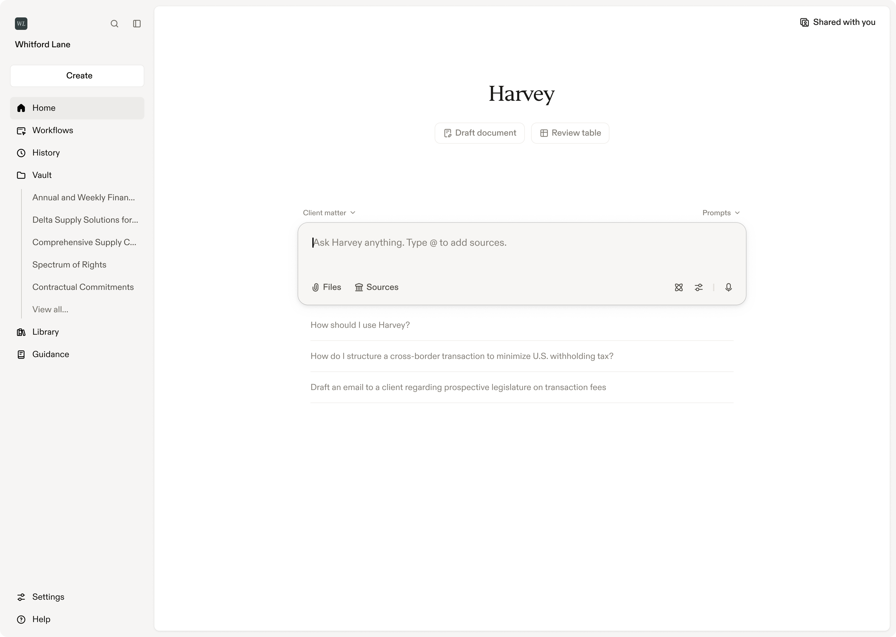
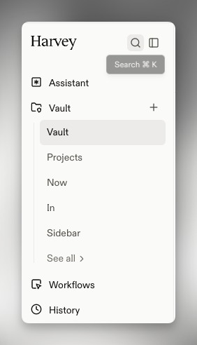
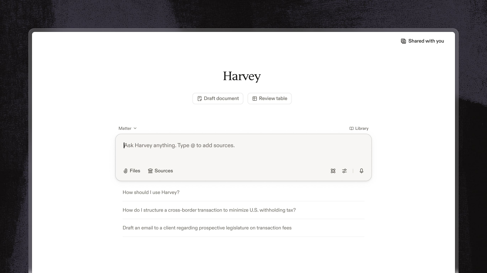
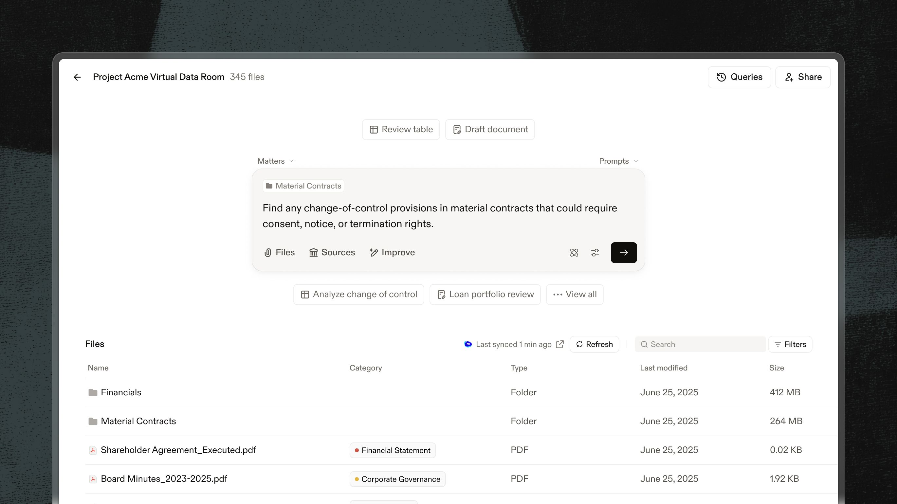
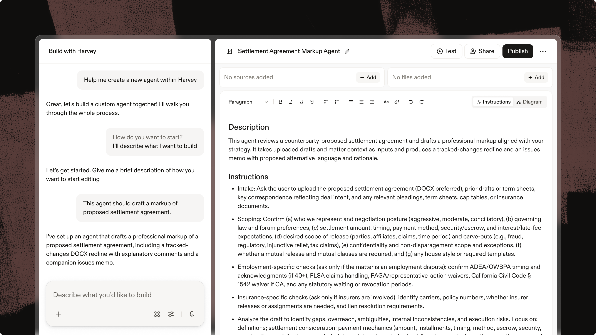
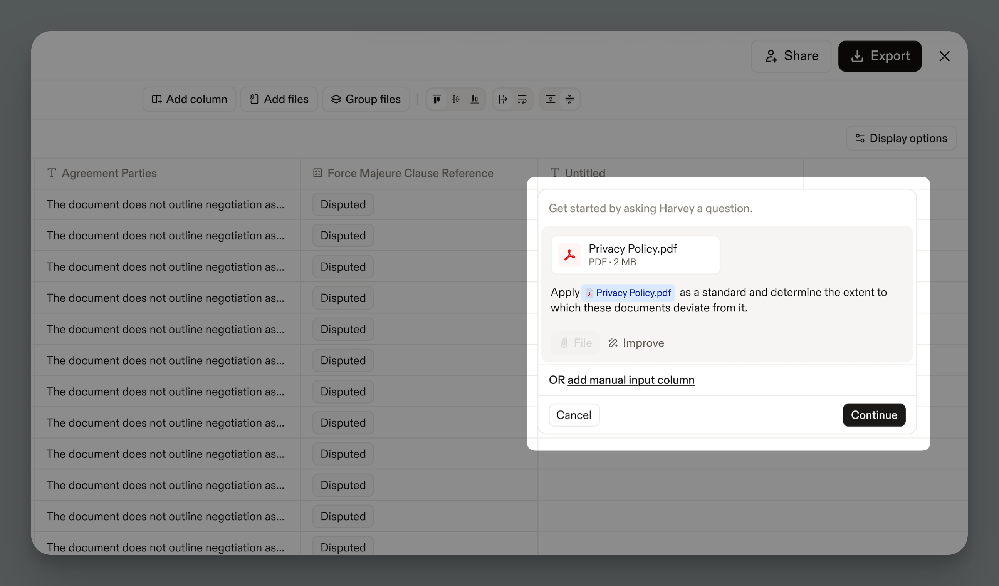
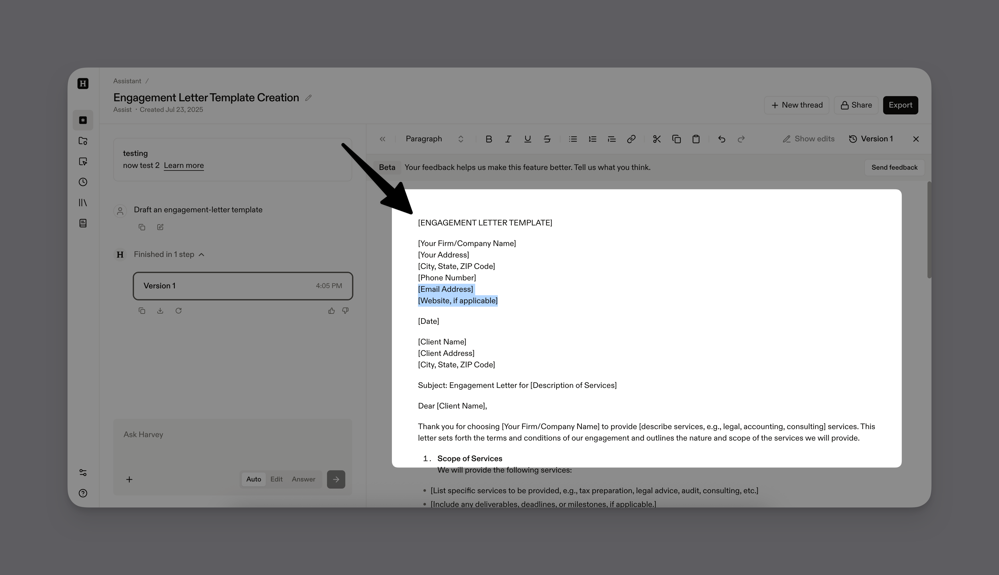
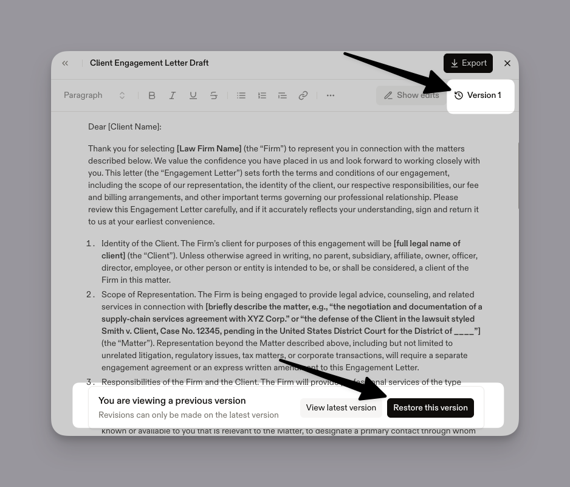
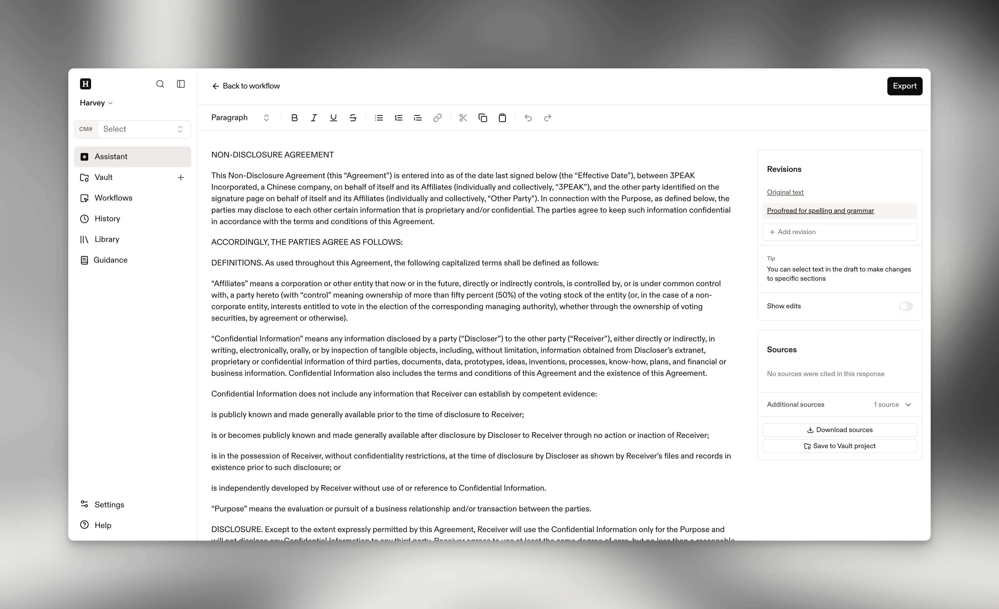
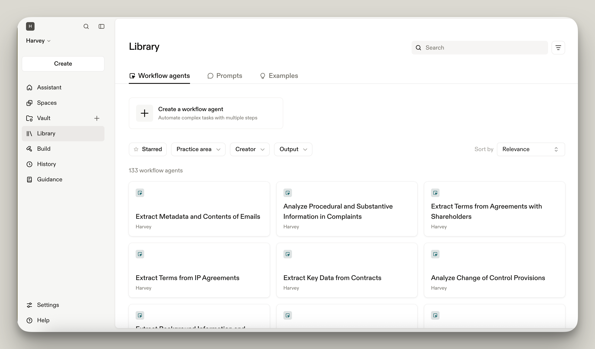

# Harvey platform research reference

Research date: 19 July 2026

This note records publicly documented Harvey functionality and interface
patterns that may inform Draftly. It is based on Harvey's public product pages
and Help Center, not an authenticated Harvey workspace. Features available only
to customers, administrator-only behavior, and unpublished interaction details
cannot be verified here.

The screenshots in this folder were published by Harvey. They are retained as
internal design-research references with their source links. They are not
Draftly assets and should not be shipped in a Draftly product.

## Product model

Harvey presents one legal-work platform rather than a collection of disconnected
AI tools. Its public material describes six main capability groups:

| Capability | Publicly documented behavior | Product lesson for Draftly |
| --- | --- | --- |
| Assistant | Ask questions, analyze documents, create drafts, perform deeper multi-step analysis, refine results, and verify linked citations | Keep one contextual assistant available throughout a matter instead of creating a separate chatbot page |
| Vault | Store and organize large document sets, query them, share them, and use them elsewhere in the platform | Treat matter documents as persistent context that feeds extraction, checking, research, and drafting |
| Review tables | Run consistent extraction prompts across files, add manual columns, group related files, verify or flag cells, ask questions over results, and export tables | Give lawyers a structured verification surface for extracted facts and red flags |
| Workflow agents | Run repeatable multi-step processes grounded in templates, examples, files, and knowledge sources | Model each notarial function as a guided workflow with explicit inputs, checks, and outputs |
| Knowledge | Search uploaded, institutional, public, and third-party legal sources with citations | Keep matter facts and legal authority separate but usable in the same task |
| Library, history, and spaces | Reuse prompts and workflows, resume prior work, share governed workspaces, and retain activity history | Make reusable legal procedures, matter continuity, permissions, and audit history first-class |

Harvey also documents integrations with Word, Outlook, document-management
systems, web browsers, email, mobile apps, APIs, and MCP. Those integrations
make the workspace useful without requiring every task to begin in its web UI.

Primary sources:

- [Harvey platform overview](https://www.harvey.ai/platform)
- [Harvey Assistant](https://www.harvey.ai/platform/assistant)
- [Harvey Vault](https://www.harvey.ai/platform/vault)
- [Harvey Workflow Agents](https://www.harvey.ai/platform/workflow-agents)
- [Harvey Knowledge](https://www.harvey.ai/platform/knowledge)
- [Harvey ecosystem and integrations](https://www.harvey.ai/platform/ecosystem)
- [Harvey Shared Spaces](https://www.harvey.ai/platform/shared-spaces)

## Publicly documented functionality

### Assistant

- Natural-language questions over uploaded files, Vault content, legal data,
  curated public sources, and web search.
- Quick Q&A, multi-step analysis, and document drafting in one thread.
- A plan mode for complex work that the user can review, edit, or approve.
- Parallel background threads with visible running, completed, and waiting
  states.
- Prompt improvement, saved prompts, source selection, file mentions, voice
  dictation, and follow-up questions.
- Linked citations that return the reviewer to the supporting source.
- Editable drafts, response modes for answering or editing, revision history,
  visible edits, and Word export with or without citations.
- Audio transcription into an editable and queryable Word document.

Sources: [Getting started with Assistant](https://eu.help.harvey.ai/articles/getting-started-with-assist-and-draft-modes)
and [Drafting in Assistant](https://eu.help.harvey.ai/articles/draft-mode-in-assist).

### Vault and review tables

- Persistent projects containing files, folders, email, queries, and review
  artifacts.
- Upload, search, filter, sync, share, and query actions within the project.
- Review tables that apply one extraction or classification instruction across
  many documents.
- A column builder, table-wide instructions, fixed reference files, manual
  notes, classification columns, conditional columns, and grouped documents.
- Per-cell source inspection, editing, comments, flags, assignments,
  verification, regeneration, and activity history.
- Questions over extracted table data and reuse of a review table as context for
  later drafting.
- Spreadsheet export with optional preservation of flagged cells.

Sources: [Vault overview](https://help.harvey.ai/articles/vault) and
[Using Review Tables](https://help.harvey.ai/articles/using-review-tables).

### Workflow agents and reusable knowledge

- Guided, predefined processes that collect required context before producing
  an output.
- Custom workflow creation in plain language, with files, templates, examples,
  knowledge sources, conditions, classifications, and multiple steps.
- Testing, sharing, permissions, publication, and organization-level reuse.
- A Library for workflow agents, prompts, and worked examples, with search,
  filters, starring, creator, practice area, and output type.
- Publicly listed workflow examples include redline analysis, translation,
  proofreading, drafting from a template, timeline extraction, legal-research
  memos, deposition analysis, discovery-response summaries, and diligence
  review.

Sources: [Workflow Agents overview](https://help.harvey.ai/articles/assistant-workflows)
and [Library](https://eu.help.harvey.ai/articles/library).

### Collaboration, governance, and continuity

- Shared matter spaces containing documents, workflows, and work product.
- Resource-level permissions, guest access, audit trails, and ethical-wall
  controls.
- History for prior questions, responses, and documents, with filters and saved
  queries.
- Enterprise controls publicly listed by Harvey include SAML SSO, audit logs,
  IP allow-listing, and data-lifecycle management.

Sources: [Shared Spaces](https://www.harvey.ai/platform/shared-spaces) and
[Getting started with Harvey](https://help.harvey.ai/articles/getting-started-with-harvey).

## Interface observations

These observations describe recurring visual and interaction patterns, not a
design system copied from Harvey.

1. A narrow persistent sidebar holds global navigation, recent work, search,
   settings, and help.
2. The main workspace is quiet and content-led: near-white surfaces, dark text,
   thin borders, restrained shadows, and one strong dark action color.
3. The home screen is action-first. A large prompt composer sits near the
   center, with files, sources, mode controls, and suggested tasks attached to
   the same interaction.
4. Context is visible where work happens. Projects, folders, sources, prompts,
   and matter selectors appear beside the current task rather than in a
   separate setup wizard.
5. Dense work uses split views. Assistant plus editor, builder plus
   instructions, or table plus a focused modal keeps the user's context on
   screen.
6. Tables are operational surfaces, not static reports. Users can add columns,
   group files, verify results, flag uncertainty, ask follow-up questions, and
   export.
7. Generated work remains editable and versioned. The interface exposes
   revisions, tracked changes, sharing, and export as part of the same screen.
8. Reusable workflows are presented as searchable library items with filters,
   not as hidden automation settings.

## Screenshot catalogue

### Assistant home

Shows the persistent navigation shell, central prompt composer, source and file
controls, quick creation actions, suggestions, and recent Vault access.

Source: [Homepage Refresh](https://help.harvey.ai/release-notes/homepage-refresh).

### Global search and sidebar

Shows the compact global navigation model and search affordance.

Source: [Getting started with Harvey](https://help.harvey.ai/articles/getting-started-with-harvey).

### Assistant workspace

Shows the low-clutter prompt-first composition used on Harvey's public product
page.

Source: [Harvey Assistant](https://www.harvey.ai/platform/assistant).

### Vault workspace

Shows a project header, project-level actions, a contextual prompt, suggested
workflows, and an operational file table in one view.

Source: [Harvey Vault](https://www.harvey.ai/platform/vault).

### Workflow builder

Shows a conversational builder beside a structured instruction editor, with
test, share, and publish actions kept in the workspace header.

Source: [Harvey Workflow Agents](https://www.harvey.ai/platform/workflow-agents).

### Review-table context

Shows a dense review table behind a focused modal for adding a reference file
to a column instruction.

Source: [Using Review Tables](https://help.harvey.ai/articles/using-review-tables).

### Draft editor

Shows the Assistant thread beside an editable document, with formatting,
version, sharing, and export controls available without leaving the task.

Source: [Drafting in Assistant](https://eu.help.harvey.ai/articles/draft-mode-in-assist).

### Draft version history

Shows restoration of prior revisions within the editor flow.

Source: [Drafting in Assistant](https://eu.help.harvey.ai/articles/draft-mode-in-assist).

### Workflow drafting

Shows a workflow result moving directly into a side-by-side editing surface.

Source: [Workflow Agents overview](https://help.harvey.ai/articles/assistant-workflows).

### Library

Shows workflow, prompt, and example discovery through tabs, search, filters,
sorting, and a restrained card grid.

Source: [Library](https://eu.help.harvey.ai/articles/library).

## What Draftly should and should not borrow

Borrow the product principles: persistent matter context, a calm workspace,
source-aware assistance, structured review, reusable workflows, side-by-side
editing, visible verification, and audit history.

Do not copy Harvey's name, logo, icon treatment, exact layout dimensions,
marketing screenshots, text, proprietary workflow catalogue, or distinctive
brand assets. Draftly also has a different center of gravity: the current
prototype is a Sri Lankan Registration of Title Act workbench with explicit
notarial steps, prescribed forms, bilingual use, voice input/output, and
statute-grounded checks.

The Draftly translation of these findings is specified in
[draftly-interface-spec.md](draftly-interface-spec.md).
