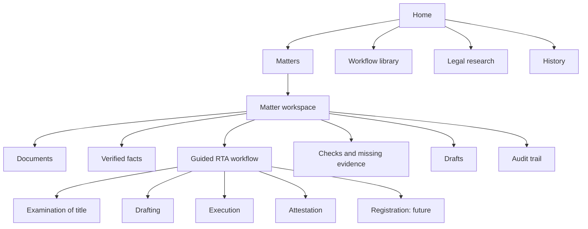
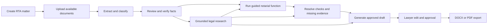

# Draftly interface specification

Status: product and UX specification only; no interface implementation is
included in this work.

## Product direction

Draftly should use the calm, workspace-oriented character seen in mature legal
AI products while remaining recognizably its own product. The first interface
is the Registration of Title Act workbench described in `roadmap.md`. The shell
should later support other conveyancing regimes and litigation without making
those unfinished workflows visible as if they already work.

The experience should feel like a lawyer's operating workspace, not a chatbot,
marketing page, or collection of dashboard cards. The matter, documents,
verified facts, legal authority, workflow progress, drafts, and audit trail must
remain connected throughout the task.

## Design principles

1. **Matter before prompt.** Every substantial action belongs to a matter or an
   explicitly selected legal-research context.
2. **Workflow before free-form AI.** Examination, drafting, execution, and
   attestation use guided steps. The assistant helps within those steps.
3. **Evidence beside output.** A fact, warning, or legal claim opens its source
   without sending the lawyer to another page.
4. **Verification is an action.** Extracted facts and generated outputs have
   visible unreviewed, verified, corrected, and blocked states.
5. **One workspace, several views.** Documents, fact review, legal research,
   workflow steps, and drafts share a consistent shell and matter context.
6. **Progress survives interruption.** The lawyer can return to the exact
   matter, step, draft version, and unresolved issue.
7. **Abstention is designed, not hidden.** Missing evidence and insufficient
   legal authority are clear product states with a next action.
8. **Bilingual by construction.** English and Sinhala labels, legal text,
   dictation, and listening controls must fit without layout breakage.

## Information architecture

### Global navigation

The persistent left sidebar contains:

- Draftly wordmark and workspace selector.
- Global search.
- Home.
- Matters.
- Workflows.
- Legal sources.
- History.
- A short recent-matters list.
- Settings and help pinned to the bottom.

The sidebar may collapse to icons on smaller desktop screens. It becomes a
drawer on mobile. The first release should not expose empty navigation entries
for future products.

### Matter navigation

Inside a matter, a secondary navigation row contains:

- Overview.
- Documents.
- Verified facts.
- Workflow.
- Checks.
- Drafts.
- Activity.

The matter name, regime, transaction type, current owner or parties, status,
and last-updated time remain visible in the header. A single overflow menu holds
rename, archive, permission, and matter-export actions.

## Screen specifications

### 1. Home

Purpose: let a returning notary resume work in one click and let a new user
start a properly scoped task.

Layout:

- Narrow sidebar.
- Main heading and a compact language control at top right.
- One primary command surface with three explicit actions: create matter, ask a
  legal question, or open a guided workflow.
- Recent matters in a compact list with status, active function, open issue
  count, and last activity.
- Upcoming obligations below recent work: monthly-list deadline, licence
  renewal, and unresolved lawyer reviews.

Do not put a marketing hero, oversized metric cards, or generic AI prompt
suggestions on this screen. Suggested actions must be notarial and connected to
the user's current work.

### 2. Create matter

Use a focused dialog or short stepper:

1. Select registration regime. RTA is active; unavailable regimes are labelled
   as future and cannot be selected.
2. Select transaction type: transfer, gift, lease, mortgage, or other.
3. Enter a privacy-safe matter reference and optional client reference.
4. Add documents now or continue to an empty matter.

Creation should take under one minute. Detailed particulars belong in the
matter workflow, not this dialog.

### 3. Matter overview

Purpose: show what is known, what is missing, and what the lawyer should do
next.

Main band:

- Matter status and active function.
- Completion across examination, drafting, execution, and attestation.
- Primary next action, such as `Verify extracted deed particulars`.

Below the main band:

- Document processing status.
- Missing or conflicting evidence.
- Recently verified facts.
- Draft outputs and their review state.
- Recent activity.

Use full-width sections rather than a grid of decorative cards. Individual
issues, documents, and drafts may use compact rows or bordered items.

### 4. Document intake

Purpose: receive what the lawyer has and explain what the matter still needs.

Required features:

- Drag-and-drop and file-picker upload.
- Camera/scan entry point on mobile.
- Processing states: uploaded, extracting, ready for review, failed, and
  replaced.
- Detected document type and language.
- Page count, extraction confidence, and detected quality problems.
- Version replacement without losing the prior audit record.
- Missing-document recommendations generated from the matter type and current
  evidence, not a manual checkbox intake form.

Selecting a document opens a three-pane review:

- Left: document pages and thumbnails.
- Center: page image or text layer.
- Right: extracted fields, confidence, source location, and verification
  controls.

### 5. Verified facts

Purpose: create the lawyer-approved structured matter record used by every
downstream step.

The default view is a review table. Rows are facts or linked entities; columns
show value, source document, pinpoint location, confidence, conflict state,
reviewer, and verification status.

The lawyer can:

- Filter to unreviewed, low-confidence, conflicting, or missing facts.
- Open the supporting page beside a fact.
- Correct a value while preserving the extracted value and change history.
- Verify one fact, a section, or a reviewed batch.
- Link duplicate people, parcels, plans, deeds, and registration references.
- Add a manual fact with a reason and source note.

Verification states:

| State | Meaning | Visual treatment |
| --- | --- | --- |
| Unreviewed | Extracted but not checked by a lawyer | Neutral outline and pending icon |
| Verified | Lawyer confirmed against evidence | Green check and reviewer/time |
| Corrected | Lawyer replaced the extracted value | Blue edit marker and before/after history |
| Conflict | Two sources disagree | Amber warning and comparison action |
| Blocked | Required evidence is absent or unreadable | Red issue marker and resolution action |

### 6. Guided RTA workflow

Purpose: take the notary through the four statutory functions while keeping
instructions, evidence, and help in one place.

Desktop layout:

- Left rail, 240-280 px: ordered workflow steps, completion, blockers, and the
  current step.
- Center, flexible: step instruction, required facts/documents, statutory
  anchors, action controls, and completion decision.
- Right rail, 340-400 px: contextual legal assistant and sources used in the
  current step.

The right rail may collapse. The center remains usable without it. On smaller
screens, the step list becomes a drawer and the assistant becomes a bottom
sheet or separate tab.

Each step contains:

- A plain-language objective.
- A listen control for the instruction.
- Required inputs with dictation controls where appropriate.
- The applicable statute section, rule, gazette form, or verified case rule.
- The supporting source excerpt and open-source action.
- Automated checks with pass, warning, fail, or needs-review states.
- A lawyer decision and note.
- Previous, save, and continue actions.

The lawyer cannot complete a blocked mandatory step without either supplying
the evidence or recording an override reason. Overrides enter the audit trail.

### 7. Legal research

Purpose: answer questions from the curated Sri Lankan corpus with visible
grounding.

The composer supports:

- Matter-aware or standalone research scope.
- Scope chips for current step, selected documents, statutes, amendments,
  gazettes, verified case rules, and the curated question bank.
- English or Sinhala input.
- Dictation.
- Saved questions and frequently wrong questions.

The answer surface shows:

- A direct answer split by question part.
- Pinpoint citation chips attached to each claim.
- An evidence pane with the exact supporting text.
- Authority type, court level, verification status, and current corpus limits.
- A clear `insufficient authority` state when the evidence gate fails.
- Add-to-matter, save-to-library, and create-check actions.

Case-law results must distinguish binding authority, persuasive authority,
historical authority, and unverified extracted candidate rules. A high model
confidence is never displayed as legal approval.

### 8. Checks and missing evidence

Purpose: turn extraction and legal rules into an actionable lawyer review.

Group findings by:

- Missing documents.
- Party or identity conflicts.
- Parcel, plan, extent, or boundary conflicts.
- Chain-of-title breaks.
- Registration or encumbrance issues.
- Stamp-duty and sequencing issues.
- Execution and attestation issues.
- Jurisdiction warnings.

Each finding includes severity, affected fact, evidence, applicable authority,
suggested resolution, owner, status, and audit history. The lawyer can resolve,
waive with a reason, request a document, or convert a finding into a checklist
item.

### 9. Draft editor

Purpose: produce and review prescribed or approved documents from verified
facts.

Use a two-pane layout:

- Left: matter assistant, missing inputs, source facts, and revision request.
- Right: paginated editable draft preview with a restrained formatting toolbar.

Required actions:

- Select approved template and transaction type.
- Show every inserted matter fact and its source on demand.
- Prevent unverified facts from silently entering a final draft.
- Highlight placeholders, unsupported clauses, and unresolved warnings.
- Request a targeted revision to selected text.
- Show changes between versions.
- Restore a prior version.
- Require lawyer approval before final export.
- Export DOCX and PDF with an audit-safe version identifier.

The initial output set should follow `roadmap.md`; the shared deed schedule and
prescribed RTA forms take priority over a general document generator.

### 10. Workflow library

Purpose: expose approved, repeatable notarial procedures.

Tabs:

- Functions.
- Draft templates.
- Question sets.
- Worked examples.

Filters include registration regime, transaction type, function, language,
output type, owner, and approval state. Users may run approved workflows. Only
authorized maintainers may edit, test, version, or publish them.

The first library should contain the RTA examination, drafting, execution, and
attestation workflows. Avoid a generic marketplace of AI agents in v0.

### 11. History and audit trail

History helps the user resume work. The audit trail proves what occurred in a
matter. They must remain distinct.

History contains recent matters, research threads, draft sessions, and workflow
runs, searchable by reference, date, function, or artifact type.

The matter audit trail records uploads, extraction versions, fact changes,
verification, overrides, retrieved authorities, workflow completion, draft
versions, approvals, exports, and permission changes. Entries are immutable to
ordinary users and display actor and timestamp.

## Core task flow

## Visual language

The visual language should be original to Draftly and quieter than a typical
SaaS dashboard.

### Color tokens

| Token | Suggested value | Use |
| --- | --- | --- |
| Canvas | `#F4F3EF` | App background |
| Surface | `#FFFFFF` | Main work surfaces |
| Ink | `#1B211D` | Primary text and strong actions |
| Muted ink | `#667068` | Metadata and secondary labels |
| Border | `#D8DDD8` | Dividers, inputs, and table rules |
| Forest | `#24533D` | Draftly accent and verified actions |
| Soft green | `#E2EEE7` | Selected and verified backgrounds |
| Teal | `#26747A` | Sources, links, and corrected facts |
| Amber | `#A56A16` | Warnings and review required |
| Red | `#A4443E` | Blocking issues and destructive actions |

Do not use gradients, decorative blobs, or a monochrome green interface. Color
communicates status; most of the interface stays neutral.

### Typography

- Brand and major workspace headings: Source Serif 4 or another restrained,
  readable serif with a suitable licence.
- Interface and body text: Inter.
- Sinhala: Noto Sans Sinhala, with line heights tested against English.
- Body size: 15-16 px on desktop; compact metadata no smaller than 12 px.
- Letter spacing remains zero.

### Shape, density, and motion

- Radius: 6 px for inputs, menus, rows, and panels; 8 px maximum for dialogs.
- Borders: 1 px neutral rules; shadows only for overlays or raised composers.
- Icon buttons use familiar symbols with tooltips.
- Dense review screens use 40-44 px table rows and sticky headers.
- Motion is limited to panel transitions, processing progress, and confirmation.
- Respect reduced-motion preferences.

## Component inventory

The implementation team should define reusable components for:

- Global sidebar and search.
- Matter header and secondary navigation.
- Status badge.
- Source citation chip.
- Authority card.
- Evidence viewer.
- Document row and processing status.
- Extracted-fact row.
- Verification controls.
- Conflict comparison.
- Workflow step rail.
- Step instruction block.
- Check or issue row.
- Assistant composer.
- Answer with claim-level citations.
- Insufficient-authority state.
- Draft editor and version selector.
- Activity timeline.
- Permission dialog.

Use icon-only buttons for familiar commands such as search, upload, microphone,
listen, edit, download, previous, and next. Use text buttons for legal decisions
such as verify, approve, waive, request document, and complete step.

## Responsive behavior

- Primary target: 1440 x 900 desktop.
- Minimum supported desktop: 1024 x 768.
- At 1024 px, collapse the assistant rail by default and shorten the recent
  matter list.
- Below 768 px, use one primary pane at a time, a navigation drawer, sticky
  bottom actions, and full-screen evidence/draft views.
- Never compress the three-pane workflow into three narrow mobile columns.
- Tables switch to focused row detail on mobile rather than horizontal text
  clipping.

## Accessibility and trust

- Meet WCAG 2.2 AA contrast and keyboard requirements.
- Keep a visible focus indicator on every interactive control.
- Never encode verification or severity by color alone.
- Provide accessible labels for icon-only controls and waveform/audio states.
- Preserve Sinhala text at 200% zoom without clipping.
- Announce upload, extraction, generation, and verification state changes to
  assistive technology.
- Display AI and extraction limitations beside the affected output, not only in
  a global disclaimer.
- Mask private data in notifications, recent-work previews, analytics, and demo
  environments.

## MVP priority

### P0: first demonstrable product

- Authentication and role-aware matter list.
- Create an RTA matter.
- Upload and process documents.
- Review and verify extracted fields beside evidence.
- Guided examination-of-title workflow.
- Step-aware grounded legal Q&A.
- Missing-document and conflict findings.
- One prescribed or approved draft flow.
- Draft review, approval, DOCX/PDF export, and audit trail.
- English/Sinhala interface switch for the demonstrated path.

### P1: complete RTA workbench

- Drafting, execution, and attestation workflows.
- Voice input and instruction playback.
- Question bank and frequently wrong questions.
- Template library and version governance.
- Monthly-list and licence reminders.
- Collaboration, comments, and assignments.

### P2: platform expansion

- Additional conveyancing regimes.
- Litigation matter type and IRAC-oriented workspace.
- External shared spaces.
- Word and document-management integrations.
- Configurable workflow builder for authorized domain experts.

## Prototype acceptance criteria

The interface prototype is ready for lawyer testing when a user can:

1. Create and reopen an RTA matter without losing context.
2. Upload a small document bundle and understand every processing state.
3. Compare an extracted fact with its exact source and verify or correct it.
4. Complete an examination-of-title step with visible statutory grounding.
5. See a missing-document or conflict finding and record its resolution.
6. Ask a matter-aware question and inspect claim-level evidence or an explicit
   insufficient-authority response.
7. Generate a draft only from approved templates and verified facts.
8. Edit, compare, approve, and export a versioned draft.
9. Inspect the matter audit trail for all preceding actions.
10. Complete the same core path at 1024 x 768 and with keyboard navigation.

## Implementation boundary

This specification deliberately does not prescribe React component names,
database tables, API routes, or model calls. Those choices should follow the
eventual application architecture. It does prescribe the user-visible states,
relationships, safeguards, and task flow that an implementation must preserve.

The Harvey research and screenshot source ledger are in [README.md](README.md).
