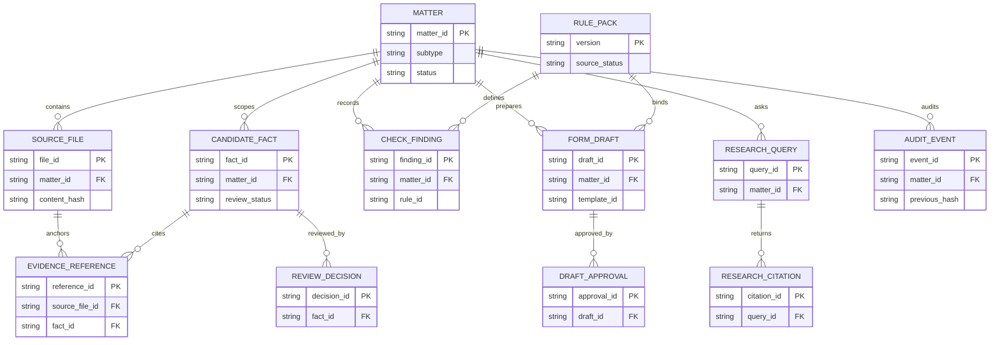

# Core Data Model

Conceptual data relationships for the matter and research workflow; entity names are simplified for presentation.

```mermaid
erDiagram
  MATTER ||--o{ SOURCE_FILE : contains
  MATTER ||--o{ CANDIDATE_FACT : scopes
  MATTER ||--o{ CHECK_FINDING : records
  MATTER ||--o{ FORM_DRAFT : prepares
  MATTER ||--o{ RESEARCH_QUERY : asks
  MATTER ||--o{ AUDIT_EVENT : audits
  SOURCE_FILE ||--o{ EVIDENCE_REFERENCE : anchors
  CANDIDATE_FACT ||--o{ EVIDENCE_REFERENCE : cites
  CANDIDATE_FACT ||--o{ REVIEW_DECISION : reviewed_by
  RULE_PACK ||--o{ CHECK_FINDING : defines
  RULE_PACK ||--o{ FORM_DRAFT : binds
  FORM_DRAFT ||--o{ DRAFT_APPROVAL : approved_by
  RESEARCH_QUERY ||--o{ RESEARCH_CITATION : returns

  MATTER {
    string matter_id PK
    string subtype
    string status
  }
  SOURCE_FILE {
    string file_id PK
    string matter_id FK
    string content_hash
  }
  CANDIDATE_FACT {
    string fact_id PK
    string matter_id FK
    string review_status
  }
  EVIDENCE_REFERENCE {
    string reference_id PK
    string source_file_id FK
    string fact_id FK
  }
  REVIEW_DECISION {
    string decision_id PK
    string fact_id FK
  }
  CHECK_FINDING {
    string finding_id PK
    string matter_id FK
    string rule_id
  }
  RULE_PACK {
    string version PK
    string source_status
  }
  FORM_DRAFT {
    string draft_id PK
    string matter_id FK
    string template_id
  }
  DRAFT_APPROVAL {
    string approval_id PK
    string draft_id FK
  }
  RESEARCH_QUERY {
    string query_id PK
    string matter_id FK
  }
  RESEARCH_CITATION {
    string citation_id PK
    string query_id FK
  }
  AUDIT_EVENT {
    string event_id PK
    string matter_id FK
    string previous_hash
  }
```
