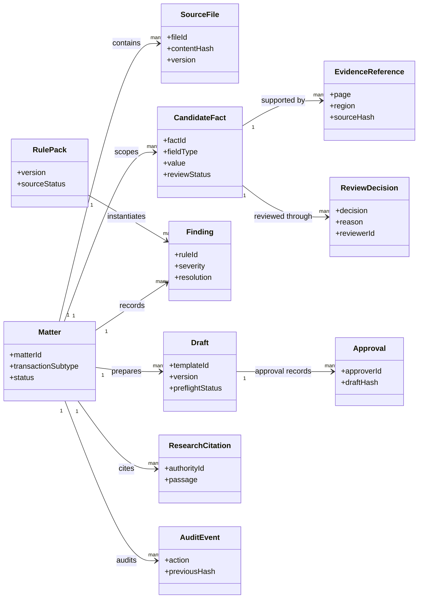

# Matter Domain Model

Conceptual relationships among matters, evidence, decisions, rule packs, drafts, citations, and audit.

```mermaid
classDiagram
  direction LR
  class Matter {
    +matterId
    +transactionSubtype
    +status
  }
  class SourceFile {
    +fileId
    +contentHash
    +version
  }
  class CandidateFact {
    +factId
    +fieldType
    +value
    +reviewStatus
  }
  class EvidenceReference {
    +page
    +region
    +sourceHash
  }
  class ReviewDecision {
    +decision
    +reason
    +reviewerId
  }
  class Finding {
    +ruleId
    +severity
    +resolution
  }
  class RulePack {
    +version
    +sourceStatus
  }
  class Draft {
    +templateId
    +version
    +preflightStatus
  }
  class Approval {
    +approverId
    +draftHash
  }
  class ResearchCitation {
    +authorityId
    +passage
  }
  class AuditEvent {
    +action
    +previousHash
  }

  Matter "1" --> "many" SourceFile : contains
  Matter "1" --> "many" CandidateFact : scopes
  CandidateFact "1" --> "many" EvidenceReference : supported by
  CandidateFact "1" --> "many" ReviewDecision : reviewed through
  Matter "1" --> "many" Finding : records
  RulePack "1" --> "many" Finding : instantiates
  Matter "1" --> "many" Draft : prepares
  Draft "1" --> "many" Approval : approval records
  Matter "1" --> "many" ResearchCitation : cites
  Matter "1" --> "many" AuditEvent : audits
```
