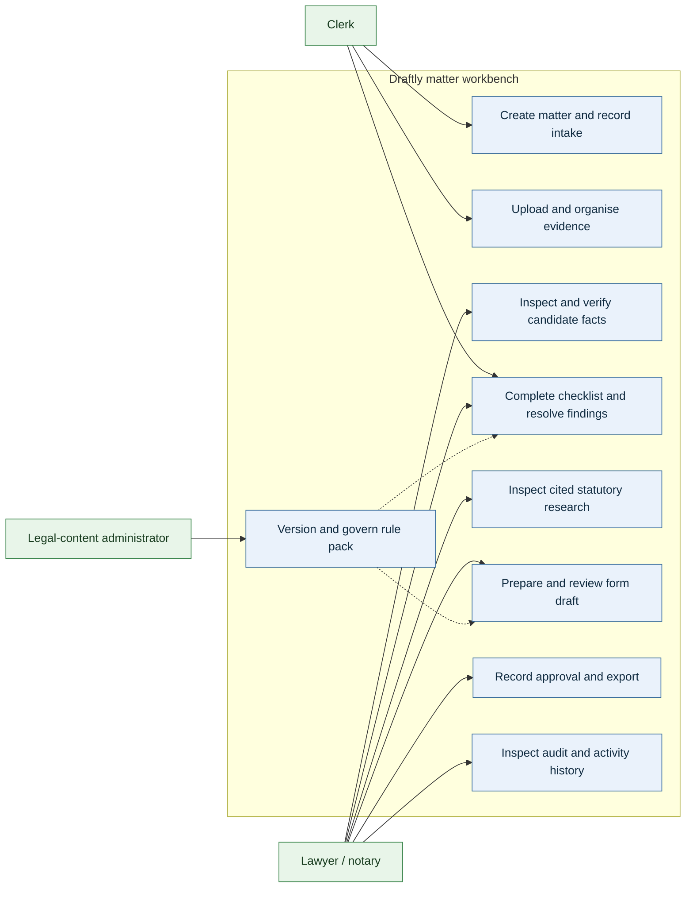

# Workbench Use Cases

Clerk, lawyer, and legal-content administrator actions in the matter workbench.

```mermaid
flowchart LR
  clerk["Clerk"]
  lawyer["Lawyer / notary"]
  admin["Legal-content administrator"]

  subgraph workbench["Draftly matter workbench"]
    intake["Create matter and record intake"]
    source["Upload and organise evidence"]
    fact["Inspect and verify candidate facts"]
    checklist["Complete checklist and resolve findings"]
    research["Inspect cited statutory research"]
    draft["Prepare and review form draft"]
    approval["Record approval and export"]
    history["Inspect audit and activity history"]
    rules["Version and govern rule pack"]
  end

  clerk --> intake
  clerk --> source
  clerk --> checklist
  lawyer --> fact
  lawyer --> checklist
  lawyer --> research
  lawyer --> draft
  lawyer --> approval
  lawyer --> history
  admin --> rules
  rules -.-> checklist
  rules -.-> draft

  classDef actor fill:#e8f5e9,stroke:#39844a,color:#173b1e
  classDef action fill:#eaf2fb,stroke:#356a9a,color:#102b40
  class clerk,lawyer,admin actor
  class intake,source,fact,checklist,research,draft,approval,history,rules action
```
