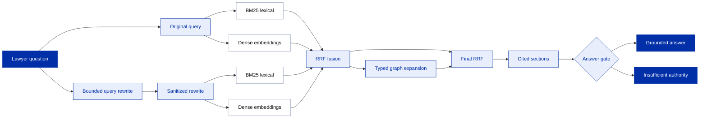

# Target hybrid retrieval pipeline

This diagram shows the planned statutory retriever. The original query remains available while a bounded rewrite adds search terms. Both paths use BM25 and dense embeddings, with ranked results fused before and after graph expansion. This exact combination has not yet been evaluated as a deployed system.

