# Software Architecture Document

## RTA-First Notarial and Conveyancing Workbench

| Document field | Value |
| --- | --- |
| Document version | 0.1 |
| Product release | V0 |
| Status | Draft for architecture and domain approval |
| Date | 29 July 2026 |
| Architecture style | Modular web application with asynchronous document processing |

## Revision History

| Version | Date | Description | Author |
| --- | --- | --- | --- |
| 0.1 | 29 July 2026 | Initial architecture for the V0 RTA workbench | Project team |

## 1. Introduction

### 1.1 Purpose

This document defines the software architecture for the initial release of a
lawyer-controlled notarial and conveyancing workbench for Sri Lankan
Registration of Title Act (RTA) matters. It translates the approved V0
requirements into components, interfaces, data structures, processing
sequences, deployment decisions, and quality controls.

The intended readers are the project team, supervisors, legal domain
reviewers, developers, testers, security reviewers, and future maintainers.
The document is also the design baseline against which implementation and test
evidence can be traced.

### 1.2 Scope

V0 supports examination of title, drafting, execution preparation, and
attestation preparation for an RTA matter. Its first active instrument flow is
the approved transfer form. The architecture supports:

- secure matter and document management;
- Google Document AI processing for supported printed and clear scanned
  documents;
- source-linked candidate particulars and lawyer verification;
- a verified structured matter record;
- deterministic document, identity, consistency, form, execution, and
  attestation checks;
- grounded research over a controlled Sri Lankan legal-source corpus;
- guided legal tasks with recorded decisions and overrides;
- generation from approved templates and verified particulars;
- lawyer review, approval, versioning, DOCX/PDF export, and audit; and
- English and Sinhala interfaces and outputs for the supported path.

V0 does not automate registration, reconstruct a historical chain of title,
extract Abstract of Title forms, accept unreliable handwriting or severely
degraded scans as verified data, or provide legal advice without lawyer
control. Unsupported documents remain available as evidence and are routed to
manual review. Later releases may add harder-document processing, more RTA
forms, wider conveyancing regimes, collaboration, integrations, and
organisation-scale operation without bypassing the evidence, verification,
approval, privacy, and audit controls established here.

### 1.3 Definitions, Acronyms, and Abbreviations

| Term | Meaning |
| --- | --- |
| API | Application Programming Interface |
| Candidate particular | A machine-extracted value awaiting lawyer review |
| Controlled content | Versioned legal rules, sources, terminology, task definitions, and templates governed by authorised users |
| Document derivative | OCR text, layout, preview, thumbnail, or extraction output created from an original document |
| Evidence span | A resolvable page, region, or text range in a specific document version |
| Finding | The result of a deterministic check: pass, warning, fail, or needs review |
| OCR | Optical Character Recognition |
| OIDC | OpenID Connect |
| Original document | The immutable file submitted as matter evidence |
| PDPA | Personal Data Protection Act, No. 9 of 2022 |
| RTA | Registration of Title Act, No. 21 of 1998 |
| Verified matter record | Lawyer-verified and corrected particulars that are authoritative for generated matter facts |
| V0 | The initial, RTA-first product release |

### 1.4 References

The formal external references appear in Section 12. This architecture is
derived from the V0 Software Requirements Specification and the approved RTA
scope, legal-source inventory, document-processing research, and interface
research. Those project artefacts are inputs to the design, not runtime
dependencies.

### 1.5 Overview

Section 2 introduces the architectural views. Section 3 records goals,
constraints, and decisions. Sections 4 to 9 present the use-case, logical,
process, deployment, implementation, and data views. Sections 10 and 11 cover
capacity, performance, and quality. Section 12 lists the cited sources.

## 2. Architectural Representation

The architecture uses six complementary views. Each view describes the same
system boundary from a different concern and shares the contracts defined in
the data view.

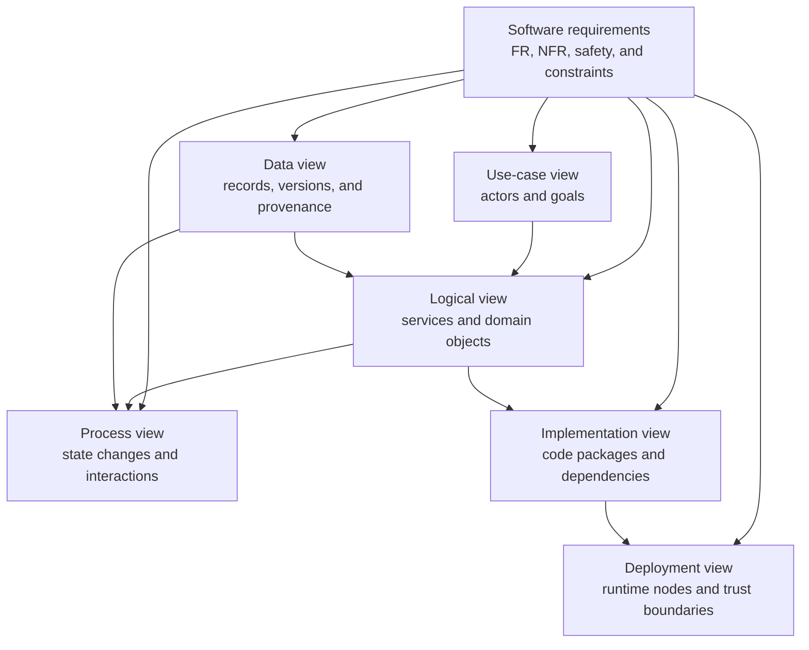

*Figure 1. Architectural views and their relationships.*

Figure 1 makes traceability explicit. A requirement is realised by one or more
use cases, logical components, processes, deployment nodes, implementation
packages, and data records. Tests can therefore trace a requirement to both
the responsible component and the persistent evidence of its execution.

The complete document landscape is shown separately because a legal workbench
must distinguish evidence, machine derivatives, controlled authority, internal
records, and approved work products.

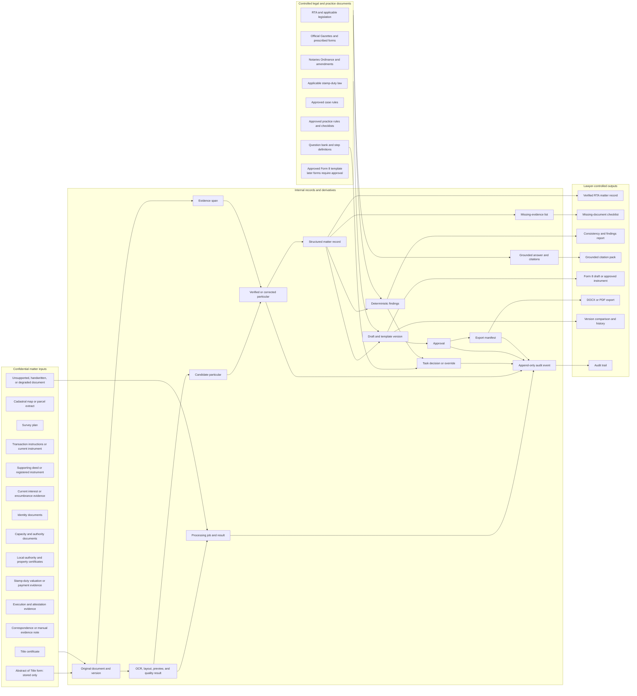

*Figure 2. Complete V0 document and record ecosystem.*

Figure 2 includes every document family that can enter, support, be created
within, or leave the V0 system. An arrow indicates controlled use or
derivation, not automatic legal acceptance. In particular, OCR output becomes
a candidate particular; only lawyer verification can place a value in the
verified matter record.

### 2.1 Document Inventory and Treatment

| Group | Documents or records | Architectural treatment |
| --- | --- | --- |
| Title and parcel | Current title certificate, cadastral map or parcel extract, survey plan | Preserved originals; approved fields extracted; identifiers cross-checked |
| Transaction | Instructions, proposed/current instrument, supporting deed or current registered instrument | Evidence for the present transaction; not used to infer an unsupported historical chain |
| Interests | Mortgage, lease, life interest, caveat, injunction, and other current registered-interest evidence | Structured as current interests with source spans and review states |
| Identity and capacity | NIC/passport or approved identity evidence; power of attorney; corporate authority; death, probate, administration, or estate authority | Access-restricted; minimum display; lawyer verification required |
| Local authority and property | Assessment notice, rates receipt or clearance, street-line, building-line, non-vesting, ownership, conformity, and building-approval records | Checked according to approved applicability rules; no checklist item becomes law without authority |
| Financial and execution | Stamp-duty valuation/payment evidence; witness details; signature, photograph, alteration, erasure, and attestation evidence | Used by deterministic drafting, execution, and attestation checks |
| Supporting material | Correspondence, manual evidence notes, photos, and other supporting files | Stored and classified; manual claims identify author, reason, and source status |
| Unsupported V0 input | Handwriting, severely degraded scans, unsupported scripts, and Abstract of Title forms | Original preserved; explicit quality/unsupported state; manual review or entry; no automatic acceptance |
| Primary legal authority | RTA, official Gazettes, Notaries legislation, and applicable stamp-duty law | Separate versioned corpus; segmented with provenance, effective date, and authority level |
| Controlled guidance | Approved case rules, practice rules, checklists, terminology, question bank, step definitions, and templates | Versioned, reviewed, activated, retired, and audited; derived guidance links to approved authority |
| Processing records | Document version, checksum, preview, OCR/layout, quality result, processing job, processor/version/region, and evidence span | Rebuildable derivatives remain separate from immutable originals and authoritative verified data |
| Matter records | Candidate, verified, corrected, conflicting, blocked, and manual particulars; parties, parcels, instruments, interests, findings, task decisions | Versioned domain records with provenance and explicit state transitions |
| Drafting records | Template version, draft snapshot, version hash, approval, export manifest | Draft generation accepts verified/corrected particulars only; post-approval edits create a new unapproved version |
| User outputs | Verified matter record, missing-evidence checklist, findings report, citation pack, Form 8 draft, DOCX/PDF, comparison, and audit trail | Permission-controlled views or generated artefacts, each identifying source and version |

## 3. Architectural Goals and Constraints

### 3.1 Goals

The architecture has seven priorities, in order:

1. Prevent unverified matter facts and unsupported legal claims from entering
   an approved output.
2. Preserve every original document and make every accepted extracted
   particular traceable to its exact version and source location.
3. Keep confidential matter information isolated by user, matter, storage
   boundary, and query.
4. Make corrections, decisions, overrides, content changes, approvals, and
   exports reconstructable from append-only history.
5. Provide recoverable failure and explicit abstention instead of silent loss
   or fabricated completion.
6. Meet the V0 response, processing, bilingual, accessibility, and export
   targets.
7. Allow later forms and conveyancing regimes to extend common contracts
   without weakening V0 controls.

### 3.2 Constraints

- The product is browser-based and applies authorisation on the server.
- Google Document AI is the V0 OCR and document-quality provider. A provider
  adapter records processor, version, region, purpose, timing, and outcome.
- Original evidence and derivatives use separate storage namespaces.
- Confidential matter records and the public or controlled legal corpus use
  separate repositories and access paths.
- The verified matter record is the only authoritative source of generated
  matter facts.
- Deterministic checks do not depend on generated prose.
- Ordinary application users cannot edit or delete audit history.
- The core V0 path supports English and Sinhala display and export.
- No copied third-party interface, text, logo, or proprietary asset forms
  part of the product.
- Provider, retention, deployment-region, and professional-conduct approvals
  must be completed before live client use.

### 3.3 Principal Architecture Decisions

| Decision | Selected V0 approach | Reason and consequence |
| --- | --- | --- |
| System shape | Modular monolith API plus separate asynchronous workers | Keeps transactions and policy enforcement coherent while isolating long-running OCR, retrieval, and export work |
| Web client | Next.js with React and TypeScript | Supports a typed, accessible browser workbench and clear route/package boundaries |
| API | FastAPI with versioned OpenAPI and Pydantic contracts | Matches the Python document/retrieval work and validates every boundary |
| Matter database | PostgreSQL | Supports transactions, JSON where needed, indexes, migrations, and defence-in-depth row security |
| Original storage | Protected object storage with immutable version references | Large evidence files do not become public paths or database blobs |
| Background work | Authenticated queue with idempotent jobs and retry policy | Upload remains responsive; provider failures become visible and recoverable |
| Document processing | Provider-neutral port with a Google Document AI adapter | Satisfies the selected V0 service while preserving an exit and manual path |
| Legal retrieval | Separate, versioned legal corpus and derived search index | Prevents accidental retrieval of confidential matter documents and preserves authority metadata |
| Checks | Versioned deterministic rule catalogue | Results are repeatable, testable, and legally reviewable |
| Draft editor | Schema-validated Tiptap JSON with protected wording and fact references | Makes template structure, provenance, and version comparison enforceable |
| Export | Server-side DOCX/PDF generation from an approved snapshot | Produces a stable artefact independent of browser rendering and records an export manifest |
| Authentication | OIDC-compatible identity provider and server-side role/matter checks | Avoids local password design and centralises identity lifecycle while retaining application authorisation |

The exact managed-service products, deployment region, Document AI processor
version, retention periods, and production identity provider remain approval
items. Their interfaces and required controls are fixed here so a selection
does not alter domain behaviour.

## 4. Use-Case View

### 4.1 Actors and Use Cases

| Actor | Responsibilities |
| --- | --- |
| Lawyer | Owns legal verification, findings decisions, final approval, and professional judgement |
| Legal clerk | Prepares matters, uploads documents, reviews candidates, and performs permitted corrections without final approval |
| Legal-content administrator | Curates source mappings, rules, task definitions, terminology, and templates |
| System administrator | Manages accounts, roles, configuration, monitoring, and recovery without acquiring unrestricted matter access |
| External identity service | Authenticates users and returns trusted identity claims |
| Google Document AI | Returns OCR, layout, and quality output for an authorised processing request |

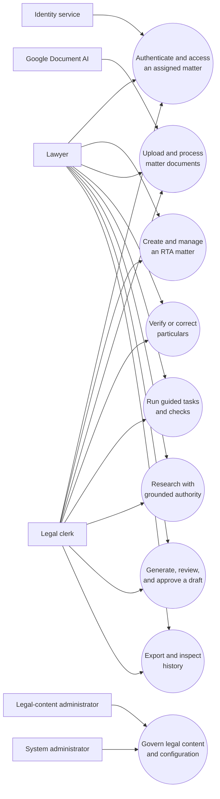

*Figure 3. V0 use-case diagram.*

Figure 3 separates preparation from legal authority. A clerk may prepare and
correct data where permitted, but only a lawyer may assign final verification,
resolve or override legal findings where authorised, and approve a work
product. External services participate through narrow interfaces and do not
become actors with approval power.

### 4.2 Use-Case Realisations

#### 4.2.1 UC-02: Create and Manage an RTA Matter

| Field | Realisation |
| --- | --- |
| Actor | Lawyer or legal clerk |
| Description | Creates a privacy-safe RTA matter and assigns permitted users |
| Preconditions | Authenticated user has matter-creation permission |
| Main flow | Enter matter reference and transaction type; select RTA regime; assign users; save; open matter overview |
| Success condition | Matter and membership records exist and an audit event records creation |
| Fail condition | Invalid data or unauthorised assignment is rejected without partial creation |
| Extensions | Archive/reopen matter; change assignment; record reason for restricted action |

#### 4.2.2 UC-03: Upload and Process Matter Documents

| Field | Realisation |
| --- | --- |
| Actor | Lawyer or legal clerk; Google Document AI |
| Description | Preserves an original and produces reviewable OCR and candidate particulars |
| Preconditions | User can access the matter; file type and size pass validation |
| Main flow | Upload; checksum and store original; create document version; enqueue processing; classify; call Document AI; store derivatives and candidates; show review state |
| Success condition | Every accepted file reaches ready-for-review or an explicit failure/manual-review state |
| Fail condition | Original is preserved and a recoverable failure is displayed; no candidate is verified automatically |
| Extensions | Duplicate warning; unsupported handwriting/degraded scan; retry; manual classification; replacement creates a new version |

#### 4.2.3 UC-04: Verify or Correct Particulars

| Field | Realisation |
| --- | --- |
| Actor | Lawyer; legal clerk within permitted preparation scope |
| Description | Compares a candidate or manual value with source evidence and records a decision |
| Preconditions | User can access the matter and evidence version |
| Main flow | Open candidate; view source page/region; compare conflicts; verify, correct, reject, or block; record reviewer and reason |
| Success condition | A new particular version and audit event preserve the decision and provenance |
| Fail condition | Missing evidence, lost permission, or stale version prevents the transition |
| Extensions | Manual entry with evidence note; batch review only after evidence is displayed; supersede an earlier value |

#### 4.2.4 UC-05: Run Guided Tasks and Checks

| Field | Realisation |
| --- | --- |
| Actor | Lawyer or legal clerk |
| Description | Runs approved, applicable task definitions and deterministic checks over verified data |
| Preconditions | Matter exists; active rule and task versions are selected |
| Main flow | Determine applicability; identify missing inputs; execute checks; create findings; inspect authority and evidence; record decision |
| Success condition | Step run records inputs, rule versions, results, and authorised decisions |
| Fail condition | Missing evidence yields needs-review/blocked, not a false pass |
| Extensions | Supply evidence; rerun after correction; lawyer resolves or records a reasoned override |

#### 4.2.5 UC-06: Research with Grounded Authority

| Field | Realisation |
| --- | --- |
| Actor | Lawyer or legal clerk |
| Description | Searches the controlled corpus and produces claim-level citations |
| Preconditions | User is authenticated; legal-corpus version is available |
| Main flow | Submit query and optional matter scope; retrieve sources; rank passages; compose bounded claims; validate citations; display answer and exact passages |
| Success condition | Every retained claim resolves to supporting authority with status and effective-date metadata |
| Fail condition | Unsupported parts explicitly abstain; no invented citation is shown |
| Extensions | Search without generation; filter by source type; mark a candidate case rule for legal review |

#### 4.2.6 UC-07: Generate, Review, and Approve a Draft

| Field | Realisation |
| --- | --- |
| Actor | Lawyer; legal clerk for preparation |
| Description | Creates a Form 8 draft from an approved template and verified particulars |
| Preconditions | Active approved template exists; mandatory facts are verified/corrected; blocking findings are resolved or validly overridden |
| Main flow | Select template; bind verified facts; validate locked wording and placeholders; save snapshot; review evidence; lawyer approves version |
| Success condition | Approval identifies approver, exact content hash, template version, fact versions, and time |
| Fail condition | Unverified mandatory fact, placeholder, changed locked text, or unresolved blocker prevents approval |
| Extensions | Edit creates a new unapproved version; compare/restore; request missing evidence |

#### 4.2.7 UC-08: Export and Inspect History

| Field | Realisation |
| --- | --- |
| Actor | Lawyer or authorised legal clerk |
| Description | Produces a controlled DOCX/PDF and reconstructs significant matter activity |
| Preconditions | User has export permission; selected artefact version is approved where approval is required |
| Main flow | Request export; generate from immutable snapshot; validate fonts/placeholders/version; store artefact and manifest; record audit event; provide expiring download |
| Success condition | Reopened output preserves English/Sinhala content and identifies the approved version |
| Fail condition | Generation or validation failure produces no misleading completed export |
| Extensions | Revoke download; re-export same snapshot; view correction, decision, approval, and permission history |

#### 4.2.8 UC-09: Govern Legal Content

| Field | Realisation |
| --- | --- |
| Actor | Legal-content administrator |
| Description | Versions and controls legal sources, rules, steps, terminology, and templates |
| Preconditions | User has content-governance role |
| Main flow | Create draft version; attach authority and effective date; run validation/tests; request legal approval; activate; retire or supersede |
| Success condition | Active content has owner, approval, effective period, version, tests, and audit event |
| Fail condition | Incomplete authority, failed tests, or unauthorised approval prevents activation |
| Extensions | Roll back by activating an earlier approved version; rebuild derived search index |

## 5. Logical View

### 5.1 Overview

The V0 API is a modular monolith: domain modules execute in one deployable API
and one transactional database, but communicate through explicit service and
repository interfaces. Document processing, retrieval/answer work, and export
rendering execute in separate workers because they are long-running,
provider-facing, or resource intensive.

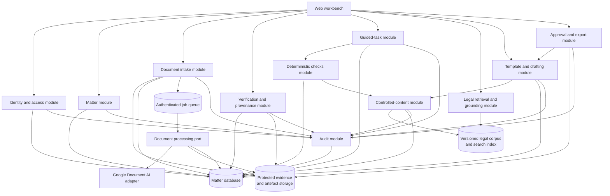

*Figure 4. Logical components and repositories.*

Figure 4 places policy at the domain boundary, not in the browser. Audit is a
cross-cutting module called inside the same transaction as each significant
state change. The legal corpus is read through the retrieval/content modules;
matter modules cannot search confidential evidence as if it were public law.

### 5.2 Architecturally Significant Design Packages

| Package | Responsibility | Owned records |
| --- | --- | --- |
| Identity and access | Identity claims, roles, matter membership, action policy | User, Role, MatterMembership |
| Matter | Matter lifecycle and current structured entities | Matter, Party, Parcel, Instrument, Interest |
| Documents | Upload, validation, immutable versioning, classification, processing state | Document, DocumentVersion, ProcessingJob, ProcessingResult |
| Verification | Evidence viewer, candidate review, corrections, conflicts, provenance | SourceSpan, Particular, ParticularVersion |
| Guidance | Applicable tasks, step runs, decisions, blocks, overrides | StepDefinition reference, StepRun |
| Checks | Deterministic rule execution and findings | RuleDefinition reference, Finding |
| Retrieval | Corpus search, passage ranking, bounded answer, citation validation | SearchRun, GroundedAnswer, Citation |
| Drafting | Template binding, editor schema, snapshots, placeholder and wording validation | Template reference, Draft, DraftVersion |
| Approval and export | Approval gate, rendering, manifest, download revocation | Approval, Export, ExportManifest |
| Controlled content | Source, rule, step, terminology, and template governance | LegalSource, LegalSection, CaseRule, RuleDefinition, StepDefinition, Template |
| Audit | Append-only event creation and authorised history queries | AuditEvent |

### 5.3 Domain Class Model

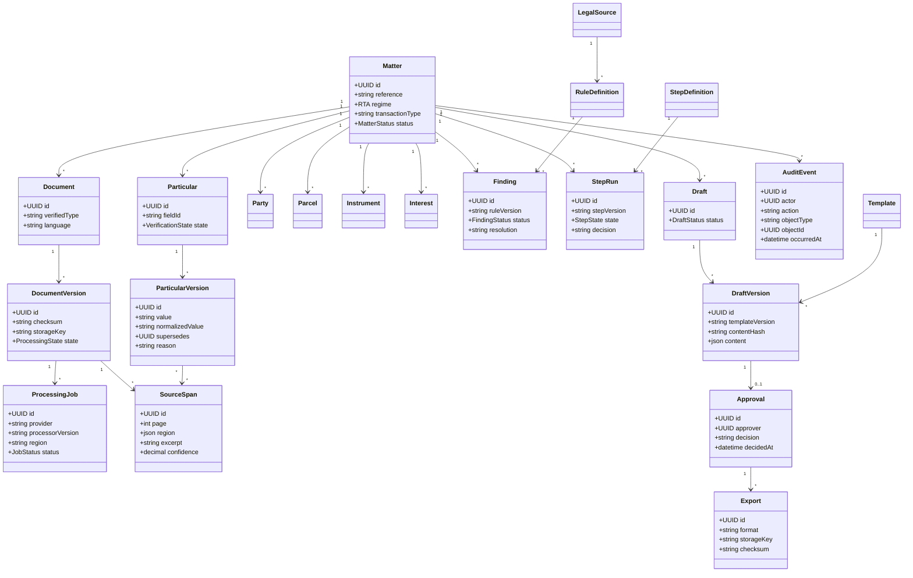

*Figure 5. Significant domain classes and provenance relationships.*

Figure 5 shows the records that enforce legal safety. A particular is not
overwritten: each correction creates a new version, and its evidence links
target an immutable document version. Draft approval targets a content hash,
so a later edit cannot retain the old approval.

## 6. Process View

### 6.1 Document-to-Draft Activity

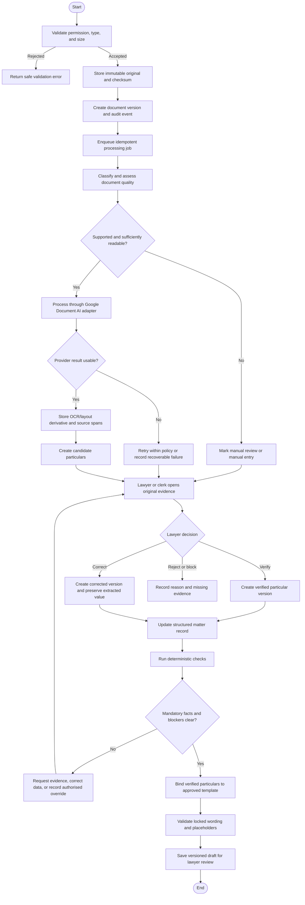

*Figure 6. Document intake, verification, checking, and draft preparation.*

The process never turns OCR confidence into legal verification. Every branch
ends in a visible review, failure, or blocked state. The loop after checks is
deliberate: the user resolves the underlying evidence or records a permitted
lawyer decision rather than editing a report until it appears to pass.

### 6.2 Document Processing Sequence

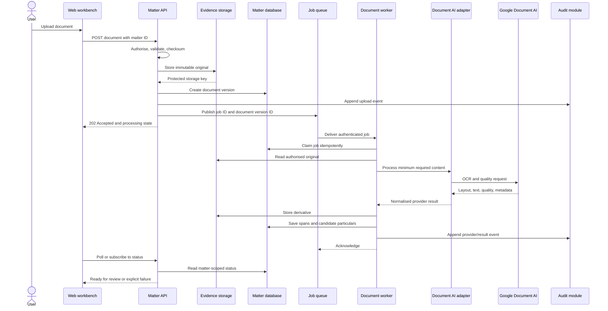

*Figure 7. Internal sequence for asynchronous document processing.*

Figure 7 shows the objects hidden by the simple user action. The API returns
after durable acceptance; a worker owns provider latency and retry. The queue
contains identifiers, not the complete confidential file, and every
matter-scoped read is authorised again.

### 6.3 Grounded Research Sequence

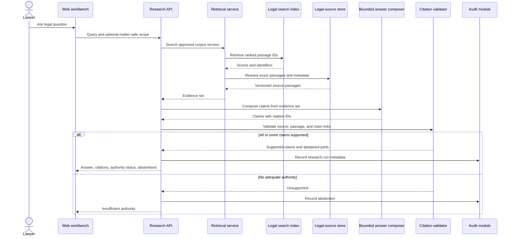

*Figure 8. Grounded legal-research sequence.*

The composer cannot write a citation into the corpus or activate a candidate
rule. The validator resolves every citation against the versioned source
store and permits partial or complete abstention. Matter content, when used to
frame a query, is not inserted into the public legal corpus.

### 6.4 Approval and Export Sequence

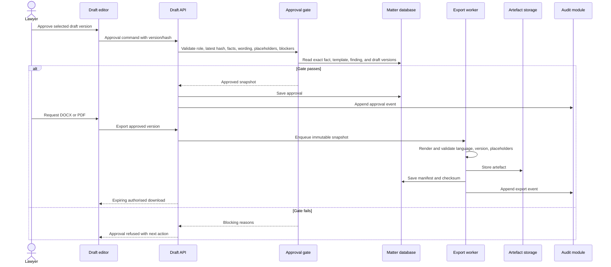

*Figure 9. Approval and controlled-export sequence.*

Approval is an atomic decision about one immutable draft version. Export
renders that snapshot, not the mutable editor state. The manifest links the
output checksum to the approval, template, fact versions, application
version, and renderer version.

## 7. Deployment View

### 7.1 Reference Deployment

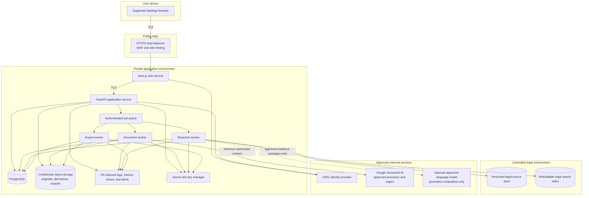

*Figure 10. Reference V0 deployment and trust boundaries.*

Figure 10 is cloud-provider neutral except for the selected Document AI
dependency. The database and storage are not public. Workers have separate
service identities and minimum permissions; for example, a research worker
cannot read matter originals, and an export worker can read only the approved
snapshot and required template assets.

### 7.2 Deployment Controls

| Boundary | Required controls |
| --- | --- |
| Browser to edge | TLS, secure cookies, CSRF protection where applicable, content security policy, safe file-upload feedback |
| Edge to services | Authenticated internal requests, request limits, correlation IDs, no trust in client-supplied role or matter ID |
| Service to database | Least-privilege database roles, transactional audit writes, encrypted connections, migration control, backup and restore tests |
| Service to storage | Opaque keys, short-lived signed access, encryption, malware/type validation, original/derivative/export separation |
| Queue and workers | Authenticated publisher/consumer, idempotency key, lease/visibility timeout, bounded retry, dead-letter/manual-review outcome |
| External processor | Approved region/version, minimum content, restricted credentials, timeout, retention/training controls, provider audit metadata |
| Legal corpus | Read-only serving version, controlled ingestion, effective-date and authority metadata, rebuildable index |
| Observability | No raw identity numbers, signatures, full addresses, pages, or generated legal content in ordinary logs |

Production network topology, recovery objectives, retention policy, and
region must be approved before live deployment. Development and demonstration
deployments use synthetic or approved anonymised documents only.

## 8. Implementation View

### 8.1 Overview

The implementation keeps framework code at the edges and domain policy in
testable application modules. TypeScript and Python types are generated from,
or checked against, versioned JSON Schema/OpenAPI contracts. A static
interface prototype may inform interaction design, but it is not the
production system or a source of production data behaviour.

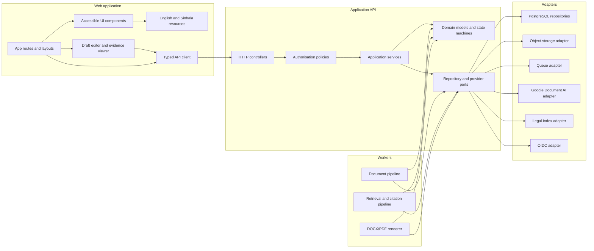

*Figure 11. Implementation components and dependency direction.*

Figure 11 applies dependency inversion: domain rules do not import cloud SDKs,
web controllers, or rendering libraries. Provider and persistence code
implements ports owned by the application. This allows deterministic tests to
replace Document AI, storage, queues, and search with controlled fixtures.

### 8.2 Layers

| Layer | Contents | Dependency rule |
| --- | --- | --- |
| Presentation | Next.js routes, components, evidence viewer, editor, language resources | Calls the API; never decides legal verification or authorisation |
| Interface | FastAPI controllers, OpenAPI schemas, command/query mapping | Validates input and delegates to application services |
| Application | Use-case orchestration, policies, transactions, job submission | Coordinates domain objects and ports |
| Domain | Matter entities, state machines, invariants, deterministic check contracts | Depends only on stable language libraries and shared schema types |
| Processing | Document, retrieval, grounding, and export pipelines | Uses application contracts; cannot bypass verification or approval |
| Infrastructure | PostgreSQL, object storage, queue, identity, Document AI, search, model adapters | Implements ports; provider details remain outside domain packages |

### 8.3 Package Structure

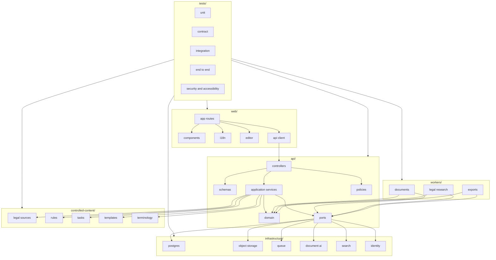

*Figure 12. Proposed source-package organisation.*

The package diagram keeps controlled legal content visible as a governed
implementation asset rather than burying it in code constants. Tests span
contracts and adapters as well as screens. A rule, template, or terminology
update follows content governance and does not require an unrelated user
interface release.

### 8.4 Interfaces and Failure Contracts

| Interface | Minimum request/response contract | Failure behaviour |
| --- | --- | --- |
| Web API | Versioned JSON over HTTPS; authenticated user; server-derived permissions; correlation ID | Structured safe error; no record existence leak; optimistic concurrency conflict where needed |
| Upload | Matter ID, file stream, declared metadata; response with document/version/job state | Reject before storage or preserve accepted original and expose recoverable state |
| Job message | Job ID, record/version ID, operation, schema version, idempotency key | Retry bounded transient failures; permanent failure becomes explicit state |
| Document processor | Protected content reference or bytes, processor config, expected schema | Timeout/retry/manual fallback; never mutates verified data |
| Legal search | Query, filters, corpus version; passage IDs, scores, source metadata | Explicit unavailable/insufficient result; no fabricated fallback |
| Grounded composer | Approved evidence passages and answer schema | Citation validation removes unsupported claims or abstains |
| Export renderer | Approved draft snapshot, template/version, format, locale | No completed artefact until placeholder, font, checksum, and reopen validation pass |
| Identity | OIDC code flow and trusted claims | Deny access on failed validation or expired session |

All commands that change state carry an expected version or idempotency key.
Provider callbacks, if used, are authenticated and matched to a stored job.

## 9. Data View

### 9.1 Data Domains

The system uses four data domains:

1. **Confidential evidence:** immutable originals, versions, previews, OCR
   derivatives, exports, and their protected storage metadata.
2. **Authoritative matter data:** verified/corrected particulars, entities,
   findings, decisions, drafts, approvals, and audit history.
3. **Controlled legal content:** statutes, Gazettes, case rules, practice
   rules, tasks, terminology, templates, versions, approvals, and effective
   periods.
4. **Rebuildable data:** search indexes, thumbnails, OCR derivatives,
   normalised candidate fields, caches, and analytics that can be regenerated
   without changing authoritative matter data.

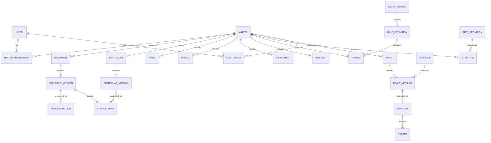

*Figure 13. Core data relationships.*

Figure 13 shows that authorisation, provenance, legal content, and work
products are first-class relationships. Historical versions remain
addressable. A replacement document can be excluded from new work without
breaking earlier evidence links, approvals, or audit events.

### 9.2 State Models

| Record | Allowed core states |
| --- | --- |
| Document processing | uploaded, queued, extracting, ready-for-review, quality-problem, manual-review, failed, superseded |
| Particular | unreviewed, verified, corrected, conflict, rejected, blocked, superseded |
| Finding | pass, warning, fail, needs-review; then open, resolved, accepted, overridden, superseded as applicable |
| Step run | not-started, ready, blocked, in-progress, completed, overridden, superseded |
| Draft | preparing, in-review, approved, rejected, superseded |
| Controlled content | draft, under-review, approved, active, suspended, retired, superseded |
| Job | queued, running, retryable-failure, failed, completed, cancelled |

Transitions are commands checked by domain policy. They record actor, reason,
input versions, and event time. A correction adds a new particular version;
it does not update the earlier row. An edit to approved content or a draft
creates a successor that requires fresh approval.

### 9.3 Integrity and Provenance Rules

- An accepted machine-extracted particular has at least one evidence span.
- An evidence span names one immutable document version and a page plus region
  or character range.
- Only an authorised lawyer can set `verified` or `corrected` as a legal
  verification decision.
- Manual particulars record author, reason, and evidence or missing-evidence
  status.
- A draft fact binding names the exact verified/corrected particular version.
- An approval names one draft version and content hash.
- An export names one approval, renderer version, format, checksum, and
  protected object key.
- A finding names the exact rule version, input versions, and authority.
- A grounded claim names resolvable source passage versions.
- Every significant state change creates an audit event in the same database
  transaction or through a transactional outbox.
- Derived indexes can be rebuilt from controlled sources and approved records.

### 9.4 Retention, Backup, and Deletion

Retention is policy-driven by data category and deployment approval. A
deletion request first evaluates legal and professional retention duties,
active holds, approval history, and backup schedules. The resulting operation
removes data no longer authorised while preserving records that must lawfully
remain and leaving a non-sensitive audit record of the action.

Backups include the relational database, protected object versions, controlled
content, encryption/key recovery material under separate control, and
configuration required to resolve evidence links. Restoration tests must show
that document-version, particular, decision, approval, export, and audit
relationships remain intact.

## 10. Size and Performance

### 10.1 V0 Workload Baseline

The reference workload is a small professional pilot, not an organisation-wide
deployment. A typical matter contains up to 15 supported documents, multiple
pages per document, hundreds of evidence spans and particulars, tens of
findings, and several draft versions. Load tests must publish concurrent-user
count, document sizes and pages, network conditions, service quotas, hardware,
dataset size, and percentile.

### 10.2 Performance Targets and Design Responses

| Target | Architecture response |
| --- | --- |
| 95% of ordinary page and matter operations within 2 seconds | Indexed matter queries, pagination, bounded response schemas, connection pooling, and no OCR/export work in request path |
| First legal-search page within 3 seconds | Prebuilt versioned index, metadata filters, bounded result count, and cached public-source passages |
| Grounded answer reaches result, partial result, failure, or abstention within 60 seconds | Separate research job, progress events, strict retrieval/composition time budgets, citation validation, and partial abstention |
| Upload acceptance acknowledged within 2 seconds | Stream validation, durable original write, job creation, and immediate `202 Accepted` response |
| Up to 15 supported documents reach review or explicit failure within 10 minutes | Parallel jobs within provider quota, page-aware batching, bounded retry, dead-letter/manual review, and per-document progress |

Database indexes cover matter membership, matter status, document and version,
particular field/state, finding state, draft status, audit time, legal-source
metadata, and job status. Large binaries remain in object storage. OCR text
and search indexes are partitioned from transactional reads.

### 10.3 Capacity Evolution

Metrics gathered in V0 include queue delay, processing duration by class/page,
provider error and retry counts, search latency, draft/export duration,
database query percentiles, storage growth, concurrent users, and manual-review
rate. V1 to V3 capacity decisions use these measurements. Services may be
split or independently scaled only when measured load or isolation needs
justify the operational cost.

## 11. Quality

### 11.1 Quality Attribute Scenarios

| Attribute | Scenario and required response |
| --- | --- |
| Legal safety | If a mandatory field is unverified or a citation does not resolve, approval or the unsupported claim is blocked |
| Security | A user requests another matter by guessed ID; server policy denies it without confirming the record exists and logs a safe event |
| Privacy | A processing job fails; logs contain job/provider codes but no document page, identity number, signature, or full address |
| Reliability | Document AI times out; the original remains intact and the job retries or reaches explicit manual review |
| Auditability | A lawyer corrects a parcel number and later approves a draft; history identifies old/new values, evidence, actor, rule results, draft hash, and approval |
| Maintainability | A Gazette changes a form; an administrator adds and approves a new effective-dated template/rule version without rewriting historical matters |
| Accessibility | A keyboard and screen-reader user completes upload, evidence review, correction, approval, and export at WCAG 2.2 Level AA |
| Bilingual fidelity | Sinhala and English source text, entered particulars, and approved output render without script loss in the browser and reopened exports |
| Recoverability | A database and object-store restore reconstructs the exact evidence-to-fact-to-draft-to-approval links |
| Performance | A 15-document matter processes asynchronously while ordinary matter work remains responsive |

### 11.2 Verification Strategy

| Level | Focus |
| --- | --- |
| Unit | State transitions, normalisation, form bindings, deterministic checks, citation rules, permission predicates |
| Contract | OpenAPI/JSON Schema compatibility; worker messages; provider-normalisation fixtures; export manifests |
| Integration | PostgreSQL transactions, object references, queue retry/idempotency, Document AI adapter, legal index, renderer |
| End-to-end | Create matter, upload, manual/automatic processing, verify, check, research, draft, approve, export, inspect history |
| Security | Cross-matter isolation, role escalation, upload attacks, signed-link expiry, secrets/log review, approval bypass, common web risks |
| Legal/domain | Lawyer-labelled extraction, evidence, rule, finding, citation, wording, and draft correctness with abstentions reported |
| Accessibility | Automated checks plus keyboard, zoom, focus, screen-reader, English/Sinhala, and print/export review |
| Recovery | Backup restore, failed-job recovery, provider outage, index rebuild, export regeneration, and audit reconciliation |

Release-blocking failures include an invented citation, unsupported retained
legal claim, cross-matter disclosure, silent loss of an accepted original,
mandatory unverified fact in an approved export, altered locked wording,
unresolved hidden placeholder, or approval attached to changed content.

### 11.3 Observability

Each request and background job carries a correlation ID. Metrics report
counts and timings by privacy-safe class and state. Alerts cover failed or
stalled jobs, provider errors, storage/database health, unusual authorisation
denials, audit-write failure, search-index version mismatch, and export
validation failure. Logs use stable record IDs and error codes instead of
client content.

### 11.4 Known Limitations and Planned Hardening

- V0 does not claim reliable extraction of handwriting, severely degraded
  pages, or unsupported scripts. These produce a visible manual-review path.
- Google Document AI language, processor, version, and regional capability
  must be verified against the approved V0 document set. Interface and export
  support for Sinhala does not imply reliable Sinhala source OCR.
- Abstract of Title forms and historical chain reconstruction are outside V0.
- Form 8 transfer is the first active prescribed instrument. Other forms
  remain inactive until their schemas, wording, checks, and tests receive
  domain approval.
- Live hosting, retention, deletion, external processing, professional
  conduct, and numerical evaluation thresholds require formal approval.

These limitations are represented as product states and test cases rather
than hidden assumptions. Later releases may improve hard-document processing
and widen notarial coverage after separate evaluation.

## 12. References

Web references were last accessed on 29 July 2026.

[1] Parliament of the Democratic Socialist Republic of Sri Lanka,
"Registration of Title Act, No. 21 of 1998," 1998. [Online]. Available:
<https://documents.gov.lk/view/act/1998/4/21-1998_E.pdf>.

[2] Government of Sri Lanka, "Gazette Extraordinary No. 2308/27,"
1 December 2022. [Online]. Available:
<https://rgd.gov.lk/web/images/ActsPDF/title/2308-27_E.pdf>.

[3] Parliament of the Democratic Socialist Republic of Sri Lanka, "Notaries
(Amendment) Act, No. 31 of 2022," 2022. [Online]. Available:
<https://documents.gov.lk/view/acts/2022/10/31-2022_E.pdf>.

[4] Parliament of the Democratic Socialist Republic of Sri Lanka, "Notaries
(Amendment) Act, No. 6 of 2024," 2024. [Online]. Available:
<https://documents.gov.lk/view/act/2024/1/06-2024_E.pdf>.

[5] Parliament of the Democratic Socialist Republic of Sri Lanka, "Personal
Data Protection Act, No. 9 of 2022," 2022. [Online]. Available:
<https://www.documents.gov.lk/view/act/2022/3/09-2022_E.pdf>.

[6] World Wide Web Consortium, "Web Content Accessibility Guidelines (WCAG)
2.2," W3C Recommendation, 12 December 2024. [Online]. Available:
<https://www.w3.org/TR/WCAG22/>.

[7] Google Cloud, "Document AI processor list," 2026. [Online]. Available:
<https://docs.cloud.google.com/document-ai/docs/processors-list>.

[8] Google Cloud, "Document AI supported files and document scan resolution,"
2026. [Online]. Available:
<https://docs.cloud.google.com/document-ai/docs/file-types>.

[9] Google Cloud, "Document AI security and compliance," 2026. [Online].
Available: <https://docs.cloud.google.com/document-ai/docs/security>.

[10] Next.js, "Next.js Docs: App Router," 2026. [Online]. Available:
<https://nextjs.org/docs/app>.

[11] FastAPI, "FastAPI features," 2026. [Online]. Available:
<https://fastapi.tiangolo.com/features/>.

[12] PostgreSQL Global Development Group, "Row Security Policies," PostgreSQL
17 Documentation, 2026. [Online]. Available:
<https://www.postgresql.org/docs/17/ddl-rowsecurity.html>.

[13] Tiptap, "Tiptap Editor Documentation," 2026. [Online]. Available:
<https://tiptap.dev/docs/editor/getting-started/overview>.

[14] Mermaid, "Mermaid User Guide," 2026. [Online]. Available:
<https://mermaid.js.org/intro/>.

[15] OWASP Foundation, "Application Security Verification Standard," 2026.
[Online]. Available: <https://owasp.org/www-project-application-security-verification-standard/>.

All architecture diagrams in this document were authored in Mermaid. They are
original project diagrams and use no third-party product interface assets.
