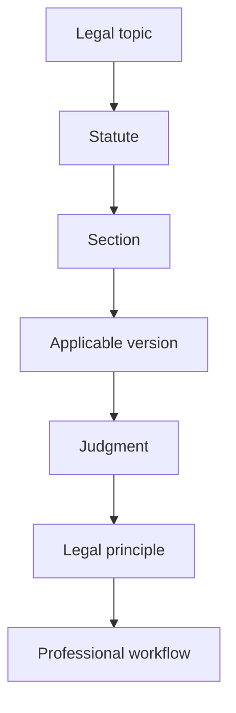
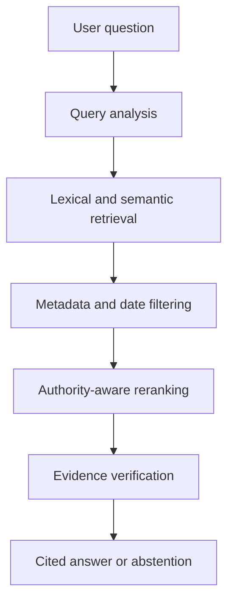

* **45–50 minutes:** presentation
* **10–15 minutes:** questions
* **Around 24–26 slides**

# Combined presentation structure

## Section 1 — Problem and Domain Validation

### Slide 1 — Title

**Draftly**
**An Authority-Aware Legal Retrieval and Document-Drafting Platform for Sri Lankan Conveyancing**

Subtitle:

> Connecting legal questions, statutory provisions, case law and professional workflows.

Keep this slide minimal.

---

### Slide 2 — A Typical Conveyancing Risk

Consider a notary preparing a property-transfer deed.

Before drafting, the notary must determine:

* Whether the seller legally owns the property
* Whether the land is correctly identified
* Whether mortgages or other encumbrances exist
* Which statutory provisions and forms are required
* Whether relevant judgments affect the transaction
* Whether every execution and attestation requirement has been satisfied

A single overlooked issue may lead to an invalid transaction, litigation or professional consequences.

---

### Slide 3 — Sri Lanka’s Legal Information Landscape

Sri Lankan conveyancing depends on information distributed across:

* Statutes and Ordinances
* Amendments
* Regulations and gazettes
* Court judgments
* Common-law and equitable principles
* Prescribed forms
* Registration rules
* Administrative procedures

The required information does not exist in one unified, searchable source.

---

### Slide 4 — The Legal Information Problem

Relevant legal principles may be buried within thousands of judgments and historical legal documents.

A practitioner must often determine:

* Which statute governs the matter?
* Which section applies?
* Has that provision been amended?
* Which version applied on the relevant date?
* How have courts interpreted the provision?
* Which judgment has greater legal authority?
* Which procedure or prescribed form must be followed?

This requires considerable time, experience and manual research.

---

### Slide 5 — Why Ordinary Legal Search Is Insufficient

Conventional keyword search can return documents, but it does not reliably:

* Connect a legal topic to the correct statutory section
* Resolve aliases and historical names of statutes
* Identify the applicable version of an amended provision
* Rank cases according to court hierarchy
* Extract the actual legal principle from a judgment
* Connect a judgment to the section it interprets
* Verify whether an answer is supported by authoritative evidence

The problem is therefore not simply finding documents. It is finding the **correct, applicable and authoritative legal rule**.

---

### Slide 6 — Domain Validation

We conducted three consultations with practising lawyers and legal experts.

The consultations helped us:

* Understand the complete conveyancing workflow
* Identify common mistakes and professional risks
* Examine real checklists and sample documents
* Understand the different registration regimes
* Identify the practical information required by notaries
* Define the initial scope of the system
* Design a lawyer-review process

One of our main consultations was with an experienced lawyer, notary and Sri Lanka Law College lecturer.

---

### Slide 7 — Problems Identified Through Consultations

The consultations identified several practical difficulties:

* Registration does not establish valid ownership in the same way under every regime.
* Fraudulent deeds and impersonation may go undetected.
* Notaries must verify identity, title, encumbrances and jurisdiction.
* Procedural rules are distributed across several legal sources.
* Junior notaries may lack knowledge normally developed through years of practice.
* Existing AI tools may generate text without following the required Sri Lankan legal structure.
* Practitioners need workflow guidance, not only exam-style legal answers.

These findings directly influenced the design of Draftly.

---

## Section 2 — Retrieval Engine as the Core Solution

### Slide 8 — Draftly’s Core Solution

Draftly is built around an **authority-aware legal retrieval engine for Sri Lankan law**.

It connects:

**Legal question → Topic → Statute → Section → Applicable version → Relevant cases → Legal principle → Supporting evidence**

Instead of generating an unsupported legal answer, Draftly retrieves and presents the underlying legal authorities.

---

### Slide 9 — Two Ways to Use Draftly

Draftly provides two connected capabilities.

#### Independent legal research

A lawyer can ask a question and retrieve the relevant statutes, sections, cases and legal principles.

#### Evidence-grounded legal workflow

The document-drafting workflow uses the same retrieval engine to identify the rules that govern each professional step.

The retrieval engine is therefore not an additional feature. It is the foundation supporting the complete platform.

---

### Slide 10 — Value of the Retrieval Engine

The retrieval engine is designed to:

* Retrieve exact statutory provisions
* Find semantically related provisions and judgments
* Resolve statute names and aliases
* Identify historical and amended versions
* Find cases interpreting a provision
* Extract holdings and relevant legal principles
* Rank judgments according to legal authority
* Connect related statutes, sections and cases
* Provide citations and supporting extracts
* Abstain when reliable evidence is unavailable

This is one of the project’s main technical and research contributions.

---

### Slide 11 — Legal Relationship Model

Draftly models the relationships between:

This structure allows the system to answer questions using connected legal evidence rather than isolated text chunks.

---

### Slide 12 — Legal Data Foundation

The corpus includes or is planned to include:

* Statutes and Ordinances     : https://www.parliament.lk/si/business-of-parliament/acts-listing
* Amendments and historical provisions  : https://www.lawlanka.com/lal_v3/welcome?menuValue=homePage
* Regulations and gazettes
* Supreme Court judgments : https://supremecourt.lk/judgements/
* Court of Appeal judgments
* CommonLII case collections :https://www.commonlii.org/lk/
* Sri Lanka Law Reports: LankaLaw
* Prescribed legal forms: From Gazzets
* Lawyer-provided checklists and practice materials

---

### Slide 13 — Current Working Corpus

You can present this as a current snapshot:

* **39 enactments**
* **3,269 statutory sections**
* **872 amendment actions**
* **3,703 conveyancing-related cases**
* **4,142 extracted legal rules**
* **3,408 high-confidence rule extractions**

Add a small note:

> The corpus is still under development and these figures are not final.

---

Slide 14 — Retrieval Approaches Under Investigation

We are currently evaluating different methods for building Draftly’s legal retrieval engine.

Potential approaches include:

Lexical retrieval for exact legal terminology and citations
Semantic retrieval for conceptually related provisions and cases
Hybrid fusion of lexical and semantic results
Metadata filtering by statute, section, court, date and topic
Structure-aware retrieval using judgment sections and holdings
Statute–case citation relationships
Authority-aware ranking based on court hierarchy
Temporal retrieval for amended provisions
Evidence verification before answer generation
---

### Slide 15 — Retrieval Process

The final answer should include:

* The relevant legal rule
* Applicable provision
* Relevant judgment
* Supporting extract
* Source location
* Confidence or verification status

Draftly retrieves the most authoritative law applicable at the relevant time and supports every answer with verifiable evidence.

The ranking process considers:

Court hierarchy and precedential authority
Whether a decision is binding or persuasive
Whether it has been followed or distinguished
Relevance of the holding and statutory citation
Historical and current versions of provisions
Amendment and effective dates
Applicability to the user’s legal question

Each answer provides:

Applicable statute, section and version
Relevant case citation and legal principle
Supporting passage and source location
Verification status

If sufficient authoritative evidence cannot be found, Draftly abstains instead of generating an unsupported answer.

### Slide 20 — Research Foundation

|  # | Paper                                                                                                                        | Why it matters to Draftly                                                                                                                        |
| -: | ---------------------------------------------------------------------------------------------------------------------------- | ------------------------------------------------------------------------------------------------------------------------------------------------ |
|  1 | [Section-Weighted Hybrid Approach for Legal Case Retrieval](https://arxiv.org/html/2606.03138v1)                             | Closest to your case-retrieval problem. Uses judgment segmentation, BM25, dense ANN, RRF and section-weighted reranking.                         |
|  2 | [LexPath: A Domain-Oriented Multi-Path Framework for Legal Article Retrieval](https://arxiv.org/html/2605.30205v1)           | Strongest match for statute/section retrieval. Adds IRAC-guided expansion, legal hierarchy, intent matching and structure-aware dense retrieval. |
|  3 | [IL-PCSR: Legal Corpus for Prior Case and Statute Retrieval](https://arxiv.org/html/2511.00268v1)                            | Directly supports your **statute ↔ section ↔ case** model by jointly retrieving statutes and precedents.                                         |
|  4 | [Temporal Misgrounding in Legal RAG](https://arxiv.org/html/2608.09393v1)                                                    | Essential for your versioned-provision system. Demonstrates why retrieval must select the law applicable on the relevant date.                   |
|  5 | [LeSICiN: A Heterogeneous Graph-Based Approach for Automatic Legal Statute Identification](https://arxiv.org/abs/2112.14731) | Shows how case text and the statute–case citation network can jointly predict applicable legislation.                                            |
|  6 | [Incorporating Legal Structure in Retrieval-Augmented Generation](https://arxiv.org/html/2505.02164v1)                       | Useful for authority-aware ranking using court hierarchy, statutory factors, citation relationships and PageRank.                                |
|  7 | [DoSSIER: Dense Retrieval and Summarisation-Based Reranking for Case Law Retrieval](https://arxiv.org/abs/2108.03937)        | Addresses long judgments through paragraph-level BM25+dense retrieval and summarisation-based reranking.                                         |

---

## Section 3 — Drafting Workflow as the Main Application

### Slide 21 — Four Registration Contexts

The lawyer consultations identified four working registration contexts:

1. **Registration of Documents Ordinance system**
2. **Registration of Title Act system**
3. **Apartment Ownership system**
4. **Special-area registration systems**

Each context has different:

* Ownership effects
* Documents
* Forms
* Verification requirements
* Drafting procedures
* Registration processes

The exact legal classification of the fourth category should be verified before the final presentation.

---

### Slide 22 — Why We Selected the RTA System

The first version focuses on post-certificate transactions under the **Registration of Title Act No. 21 of 1998**.

It was selected because:

* It has a structured and statute-driven workflow.
* It uses prescribed forms.
* The scope is comparatively self-contained.
* Its documents are generally more machine-readable.
* Practitioners may be unfamiliar with its procedures.
* It provides a manageable domain for developing and evaluating the first version.

---

### Slide 23 — Project Scope Boundary

#### Included in the first version

* Post-certificate RTA transactions
* Retrieval of applicable statutes and regulations
* Prescribed forms
* Transaction-specific workflows
* Document verification
* Draft generation
* Lawyer review

---

### Slide 24 — Six Functions of a Notary

The consultation organised conveyancing into six functions:

1. Examination of title
2. Drafting
3. Execution
4. Stamping
5. Attestation
6. Registration

The initial system concentrates on:

* Examination of title
* Drafting
* Execution
* Attestation

Stamping is included where required by the workflow, while complete registration support can be expanded later.

---

### Slide 25 — Examination of Title Workflow

The consultation described examination of title as an ordered process:

1. Search the relevant land records
2. Identify the present owner
3. Trace the chain of title
4. Check mortgages, charges and encumbrances
5. Verify local-authority documents
6. Confirm the identities of the parties
7. Identify inconsistencies and risks
8. Prepare the title report

At each step, the retrieval engine provides the applicable legal requirements and cautionary case-law principles.

---

### Slide 26 — Retrieval-Powered Drafting

The drafting component is not simply template filling.

For every workflow step, Draftly retrieves:

* Statutory requirements
* Prescribed forms
* Procedural rules
* Case-law principles
* Common mistakes
* Cautionary notes

---

Slide 27 — Document-Processing Pipeline

The proposed document workflow consists of:

Document upload, splitting and classification
OCR, layout analysis or OCR-free extraction
Structured legal-information extraction
Cross-document linking and chain-of-title construction
Consistency, completeness and legal-rule checks
Draft generation followed by lawyer verification

The pipeline design is being informed by research on:

Production-scale OCR and LLM microservices — Operationalizing Document AI
Document splitting, multimodal extraction and compliance validation — IDP Accelerator
OCR-free document understanding — Donut
Multi-agent processing with human validation — MADP
Reconstruction-based extraction verification — RaV-IDP

These approaches are currently being compared to determine the most suitable pipeline for Sri Lankan legal documents.

---

### Slide 28 — Example End-to-End Workflow

For an RTA transfer:

1. The lawyer selects **Transfer**.
2. The system requests the required documents.
3. Party and property details are extracted.
4. Identity and jurisdiction are checked.
5. The relevant provisions and prescribed forms are retrieved.
6. The correct transaction order is presented.
7. Missing information and inconsistencies are flagged.
8. The draft is generated.
9. Every major requirement is linked to its authority.
10. The lawyer reviews and approves the output.

This is a good place for a short product demonstration.

---

### Slide 29 — Practical Features From Consultations

#### MVP features

* Transaction-specific RTA workflows
* Statute, section and case retrieval
* Prescribed forms
* Document extraction
* Identity-verification checklist
* Missing-document detection
* Draft generation
* Evidence-linked lawyer review

#### Future enhancements

* Sinhala and Tamil interfaces
* Voice-based information entry
* Monthly-list generation
* Deadline reminders
* Additional registration regimes
* Advanced litigation workflows

Only include voice in the MVP column if the team has formally committed to implementing it.

---

### Slide 30 — Lawyer-in-the-Loop Design

Draftly does not replace the lawyer.

The system:

* Organises evidence
* Retrieves applicable authorities
* Suggests workflow steps
* Detects potential problems
* Produces reviewable drafts
* Records the evidence behind its output

The lawyer:

* Reviews the extracted information
* Confirms the legal interpretation
* Corrects errors
* Approves the final document
* Remains responsible for professional judgment

---

## Section 4 — Evaluation and Contribution

### Slide 31 — Evaluation Strategy

The retrieval engine will be evaluated using a lawyer-reviewed gold dataset.

#### Retrieval evaluation

* Statute and section recall
* Relevant-case recall
* Precision at (k)
* Mean Reciprocal Rank
* Authority-ranking accuracy
* Applicable-version accuracy

#### Answer evaluation

* Citation correctness
* Faithfulness to retrieved evidence
* Legal completeness
* Unsupported-claim rate
* Abstention accuracy

#### Workflow evaluation

* Missing-document detection
* Consistency-check accuracy
* Draft completeness
* Time saved
* Lawyer correction effort

---

### Slide 33 — Main Contributions

Draftly contributes:

1. A structured Sri Lankan legal corpus
2. Relationships between topics, statutes, sections and cases
3. A version-aware statutory retrieval model
4. Authority-aware case-law ranking
5. Evidence-grounded legal answers
6. A retrieval-powered conveyancing workflow
7. A lawyer-review and verification mechanism
8. A domain-expert evaluation framework

---

### Slide 34 — Current Progress

You can show:

* Lawyer consultations completed
* Initial RTA scope defined
* Legal documents and checklists collected
* Statutory corpus created
* Case-law corpus processed
* Legal rules extracted from judgments
* Retrieval architecture designed
* Workflow and system architecture under development
* Gold evaluation dataset being prepared

Add:

> The corpus, workflows and evaluation framework are still being developed and have not yet been finalised.

---

### Slide 35 — Overall Value

Draftly provides two levels of value.

#### Legal research

It helps lawyers find the correct provisions, cases and legal principles.

#### Professional workflow assistance

It converts those retrieved authorities into step-by-step checks, document verification and lawyer-reviewable drafts.

Strong closing line:

> Draftly does not begin by generating a deed. It begins by finding and verifying the law that must govern the deed.