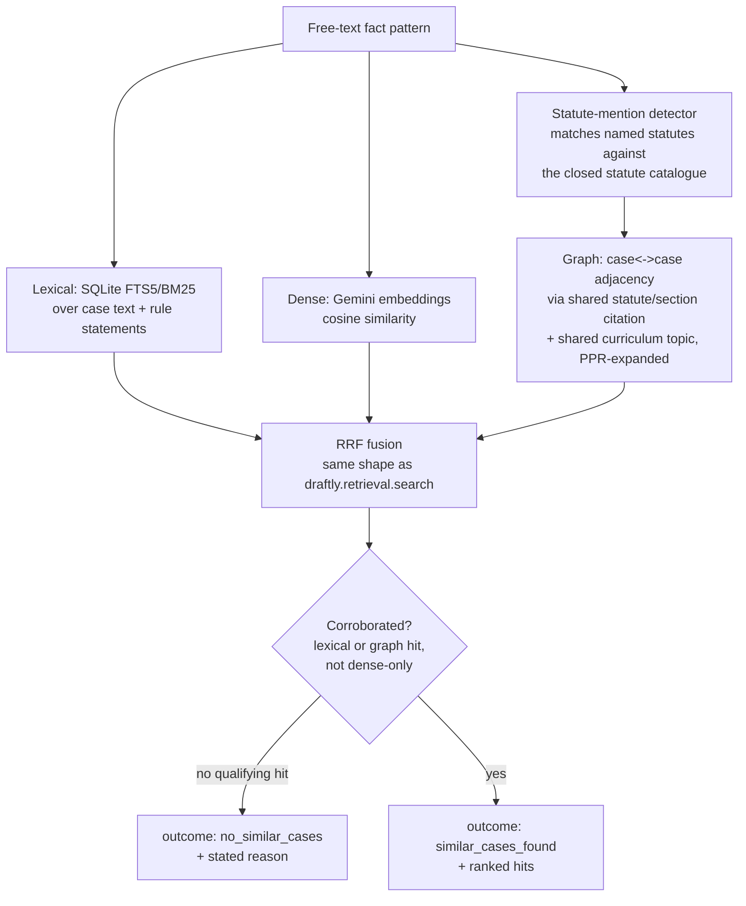

# Similar-Case Retrieval: Architecture and Test Results

Status: `unverified`. Grading below was produced by an LLM (Haiku) reading
retrieved excerpts, not by a lawyer — treat it as a development-time signal
about the retrieval pipeline's precision, not a legal-correctness claim.

## What this is

`draftly.case_retrieval` answers one question: given a free-text fact
pattern, which past cases in the conveyancing-flagged corpus are similar —
or is there genuinely nothing similar? It is a new package, kept separate
from the statutes-only `draftly.retrieval` engine (see that package's
`corpus.py` scope guards in `CLAUDE.md`) so that widening case-law coverage
never risks widening what the statute engine will answer from.

Population is fixed to the 5,121 of 9,177 cases already flagged
`conveyancing_match=true` in `data/processed/cases.jsonl` — an existing gate
(`scripts/classify_commonlii_convayancing_improved.py` and predecessors),
not a new classifier built for this feature.

## Architecture



| Stage | File |
| --- | --- |
| Conveyancing population + statute/topic bridge loading | `src/draftly/case_retrieval/corpus.py` |
| Fingerprinted BM25 index (lexical channel) | `src/draftly/case_retrieval/index.py` |
| Gemini dense embeddings, cached by fingerprint | `src/draftly/case_retrieval/embeddings.py` |
| Case-to-case graph (statute/topic bridge) + PPR expansion | `src/draftly/case_retrieval/graph.py` |
| RRF fusion + abstention | `src/draftly/case_retrieval/search.py` |
| CLI / API | `src/draftly/case_retrieval/__main__.py`, `/similar-cases` in `src/draftly/retrieval/api.py` |

### How "no similar cases" is decided

Dense cosine similarity alone is easy to fool with generic legal
boilerplate, so a hit is only returned if corroborated by the lexical or
graph channel — dense similarity is additive evidence, never sufficient
alone. Lexical corroboration itself requires at least 3 distinct query
tokens to actually appear in the case text (`MIN_LEXICAL_OVERLAP` in
`search.py`), not just any one OR-matched term — an earlier version of this
check (requiring only 1 overlapping token) let an off-domain physics query
("quantum entanglement in superconducting qubit arrays") through, because a
land-acquisition judgment happened to discuss "computing the **quantum** of
compensation." Raising the floor to 3 tokens fixed that specific case, but
this is a heuristic tuned against a handful of manual probes, not a
calibrated statistical threshold — no similar-case gold set exists to
calibrate against, and this project does not have one for this feature. It
is a measured, working boundary, not a solved one.

The dense channel was **not exercised** in this test run: no
`GEMINI_API_KEY` was configured in this environment, so
`embeddings.dense_lookup()` returned empty and every result below comes from
the lexical + graph channels only, exactly as the engine is designed to
degrade.

## Test set: 20 queries from past exam papers

`src/questions.md` holds 18 top-level questions (73 sub-parts) across two
Sri Lanka Law College Conveyancing past papers (April 2026, October 2025) —
none written as case-law queries. `scripts/similar-case-retrieval/build_test_set.py`
hand-selects 20 sub-parts that are fact-driven and case-law-answerable,
skipping pure arithmetic (stamp-duty calculations) and pure statutory-note
recitation, and favoring the topics densest in the corpus (partition,
prescription, notarial liability, deeds/gifts, succession). Each query
combines the sub-part's fact-pattern preamble with its specific question, so
`find_similar()` sees the kind of input a lawyer would actually submit.
Full list and selection rationale: `test_queries.jsonl`.

## Grading method

For each of the 20 queries, `find_similar()` was run (`run_eval.py`,
producing `evaluation/runs/similar-case-retrieval-v1/`), then **this
session (Sonnet) dispatched one independent Haiku subagent per query** —
each reading only that query's fact pattern, outcome, and retrieved hits
(no shared context between them), and returning one verdict from a fixed
five-way rubric: `relevant`, `partially_relevant`, `irrelevant`,
`correct_abstention`, `incorrect_abstention`. Sonnet aggregated the 20
verdicts below without altering any of them.

A second, independent pass then reduced the question to a strict binary:
20 **fresh** Haiku subagents (one per query, no memory of the first pass)
were each given only the query's fact pattern, outcome, and hits, and a
rule for CORRECT vs. INCORRECT — CORRECT requires at least one retrieved
case (for `similar_cases_found`) to genuinely address the same legal
doctrine as the query, tolerating off-topic padding among the rest; an
abstention is CORRECT only if a lawyer would genuinely expect no precedent
to exist. Sonnet again aggregated these 20 verdicts without altering them.

## Results

### Binary correctness check and accuracy

| # | Source | Correct? | Why |
| --- | --- | --- | --- |
| scr-01 | April 2026 Q1.1 | ✅ | Somalatha and Dingiri Banda cases directly address gift law and succession. |
| scr-02 | April 2026 Q1.3 | ✅ | Azhar Ghouse and Rankiri genuinely address intestate succession doctrine, though neither reaches the foreign-heir restriction specifically. |
| scr-03 | April 2026 Q3.2 | ❌ | All hits are administrative/constitutional writs matched on "Divisional Secretary"; none address LDO mortgage-approval doctrine. |
| scr-04 | April 2026 Q3.3 | ✅ | Cases before the Commissioner General of Lands are plausibly relevant to grant-cancellation precedent. |
| scr-05 | April 2026 Q3.4 | ❌ | All hits are administrative land-official disputes matched on "land"/"commissioner"; none reach Third Schedule succession doctrine. |
| scr-06 | April 2026 Q5.1 | ✅ | King v. Perera directly addresses Notaries Ordinance authority and deed attestation. |
| scr-07 | April 2026 Q5.4 | ✅ | Carthelis v. Ranasinghe directly addresses Notaries Ordinance duties. |
| scr-08 | April 2026 Q6.3 | ✅ | Hall v. Pelmadulla and Ebert Silva directly address non-registration of a notarial deed. |
| scr-09 | April 2026 Q9.1 | ✅ | Gamini Ranasagalla Corea genuinely addresses Last Will execution requirements. |
| scr-10 | October 2025 Q1.1 | ✅ | All five hits directly address fidei commissum, conditional gifts, and devolution. |
| scr-11 | October 2025 Q2.2 | ✅ | All five hits directly address Kandyan-law gift irrevocability and revocation procedure. |
| scr-12 | October 2025 Q3.1 | ✅ | Rohan De Soyza v. Jinendradasa genuinely addresses Prevention of Frauds Ordinance and deed validity. |
| scr-13 | October 2025 Q3.2 | ✅ | King v. Perera (1930) directly addresses notarial authority to attest deeds outside one's own district. |
| scr-14 | October 2025 Q4.2 | ✅ | Strong v. Marikar directly addresses caveats under the Registration of Documents Ordinance. |
| scr-15 | October 2025 Q5.3 | ❌ | All hits are coincidental keyword matches (undue influence, land valuation, misconduct); none address power-of-attorney scope for leasing. |
| scr-16 | October 2025 Q6.4 | ❌ | Four of five hits are unrelated fundamental-rights cases; the fifth shows no evidence of addressing prescriptive rights. |
| scr-17 | October 2025 Q7.1 | ✅ | Lee v. Chandrawarnam directly addresses notary jurisdictional limits across districts. |
| scr-18 | October 2025 Q9.3 | ✅ | Two hits directly address guardian/curator power to transact a minor's property. |
| scr-19 | October 2025 Q9.4 | ❌ | All hits are lexical matches unrelated to a minor's legal capacity to purchase land or who signs on their behalf. |
| scr-20 | October 2025 Q9.5 | ❌ | Retrieved cases address will validity/probate, not notary confidentiality/disclosure obligations. |

**Accuracy: 14/20 = 70%.**

The five-way rubric above and this binary check broadly agree: every query
graded `relevant` or `partially_relevant` there is CORRECT here except
scr-16 (a `partially_relevant` verdict where the one plausible hit's
excerpt didn't actually confirm relevance on closer, binary-forced
scrutiny), and all three `irrelevant` queries (scr-03, scr-05, scr-15) are
INCORRECT here, plus two additional queries (scr-19, scr-20) that the
five-way pass called "partially_relevant" but the binary pass judged to
have no genuinely on-topic hit at all — the binary rubric is stricter
because it forces a single yes/no call instead of allowing a hedged
middle verdict.

### Five-way appropriateness grading

| Outcome | Count |
| --- | ---: |
| `relevant` | 2 |
| `partially_relevant` | 15 |
| `irrelevant` | 3 |
| `correct_abstention` | 0 |
| `incorrect_abstention` | 0 |
| **Total** | **20** |

All 20 queries returned `similar_cases_found` (no abstentions were
triggered by this particular set — every query was a real, detailed exam
fact pattern with substantial lexical overlap against the corpus, so this
test set does not exercise the abstention path; the earlier physics-query
probe during development did).

| # | Source | Verdict | Why |
| --- | --- | --- | --- |
| scr-01 | April 2026 Q1.1 | partially_relevant | Two of five hits (gift-revocability/succession cases) genuinely on-topic; three are unlabeled generic court headers. |
| scr-02 | April 2026 Q1.3 | partially_relevant | Three of five hits address intestate succession; none reach the Land (Restrictions on Alienation) Act specifically. |
| scr-03 | April 2026 Q3.2 | irrelevant | All five hits are administrative writs matched only on "Divisional Secretary"; none address LDO mortgage-approval doctrine. |
| scr-04 | April 2026 Q3.3 | partially_relevant | Two hits are genuine land-administration cases; three are unrelated litigation. |
| scr-05 | April 2026 Q3.4 | irrelevant | All hits are administrative land-official writs matched on "land"; none reach LDO Third Schedule succession doctrine. |
| scr-06 | April 2026 Q5.1 | partially_relevant | Two hits directly address Notaries Ordinance deed-execution authority; three are unrelated property disputes. |
| scr-07 | April 2026 Q5.4 | partially_relevant | One hit (Carthelis v. Ranasinghe) is highly on-point for notary duties; others are wills/trusts or place-name-only matches. |
| scr-08 | April 2026 Q6.3 | partially_relevant | Two hits directly address non-registration consequences; one is off-topic (Trust Receipts Ordinance). |
| scr-09 | April 2026 Q9.1 | partially_relevant | Two hits address will execution/estate administration; three are unrelated. |
| scr-10 | October 2025 Q1.1 | relevant | All five hits address fidei commissum, conditional gifts, and partition-decree devolution — the exact doctrine in play. |
| scr-11 | October 2025 Q2.2 | relevant | All five hits directly address Kandyan-law gift irrevocability and its statutory revocation procedure. |
| scr-12 | October 2025 Q3.1 | partially_relevant | One hit directly on point (Prevention of Frauds Ordinance + deed issues); three are unrelated filler. |
| scr-13 | October 2025 Q3.2 | partially_relevant | One hit addresses a notary attesting outside their own district; three are wills cases matched only on "notary". |
| scr-14 | October 2025 Q4.2 | partially_relevant | One hit addresses caveats under the Registration of Documents Ordinance; four are off-topic. |
| scr-15 | October 2025 Q5.3 | irrelevant | All five hits matched on generic property vocabulary; none address power-of-attorney scope (sale vs. lease). |
| scr-16 | October 2025 Q6.4 | partially_relevant | Four of five hits are unrelated fundamental-rights cases; one is plausibly on-topic for prescriptive rights. |
| scr-17 | October 2025 Q7.1 | partially_relevant | One hit addresses notary territorial jurisdiction directly; others are succession or generic property disputes. |
| scr-18 | October 2025 Q9.3 | partially_relevant | Two hits address guardian/curator authority over a minor's property directly; others are tangential. |
| scr-19 | October 2025 Q9.4 | partially_relevant | One hit addresses minors and property interests directly; others are procedural or only adjacent. |
| scr-20 | October 2025 Q9.5 | partially_relevant | One hit touches notarial duties; four are probate cases matched only on the word "Will". |

## Reading these results honestly

- **Binary accuracy is 70% (14/20).** That is the headline number for the
  paper. It is stricter than it looks from the five-way breakdown alone,
  because a forced yes/no call collapsed two `partially_relevant` queries
  (scr-19, scr-20) into INCORRECT once a grader had to commit to whether
  any single hit was genuinely on-topic rather than just similar in
  vocabulary.
- **0/20 fully irrelevant-and-returned-nothing-useful, but only 2/20 fully
  relevant.** The dominant outcome (15/20) is `partially_relevant`: the
  fusion reliably surfaces at least one genuinely on-point precedent, but
  padding the result list to `limit=5` routinely pulls in lexically-matched
  but doctrinally unrelated cases (especially generic land-administration
  writs that share address/authority-name vocabulary with LDO questions, and
  wills cases that share only the word "notary" or "Will" with notarial-duty
  questions).
- **The 3 `irrelevant` cases share a pattern**: LDO/administrative-approval
  questions (scr-03, scr-05) and the power-of-attorney-scope question
  (scr-15) pull in cases that share institutional vocabulary (Divisional
  Secretary, land officials, "property") without sharing the actual legal
  question. These are exactly the false positives the lexical corroboration
  floor was built to catch during development (see the "quantum" probe
  above) — it caught the adversarial off-domain case, but not these
  same-domain-different-doctrine cases, which is a harder problem: the words
  are genuinely legally relevant, just not to the specific issue asked.
- **A smaller `limit` would likely raise precision** at the cost of recall
  — most of the genuinely on-topic hits above rank in position 1-2, and the
  padding cases arrive at positions 3-5. This project has not tuned that
  trade-off; it is reported here as a known lever, not applied.
- **No abstention was exercised by this test set.** Every one of the 20
  queries is a rich, detailed exam fact pattern that shares real vocabulary
  with the corpus, so none of them reached the `no_similar_cases` path.
  The abstention mechanism was validated separately during development
  (see `search.py`'s docstring and `tests/test_similar_case_retrieval.py`),
  not by this 20-query set.

## Architecture comparison: 4 configurations, same 20 queries

The failure analysis above names two specific mechanisms that let
wrong-domain padding through: a graph bridge that includes noisy,
never-verified topic links, and a lexical corroboration count that treats
"divisional"/"secretary"/"will" the same as genuinely rare doctrine terms.
Both are real, data-grounded hypotheses — and both, measured, made accuracy
**worse**, not better. This section reports all four configurations tested
against the identical 20-query set, using the identical grading protocol
(20 independent Haiku subagents per variant, binary correct/incorrect
rubric, no memory of other variants' grading, aggregated by this session
without alteration).

| Variant | `GRAPH_VERIFIED_ONLY` | `LEXICAL_IDF` | Accuracy | vs. baseline |
| --- | --- | --- | ---: | ---: |
| **v1 (baseline)** | off | off | **70% (14/20)** | — |
| v2 | on | off | 55% (11/20) | −15 pts |
| v3 | off | on | 30% (6/20) | −40 pts |
| v4 (combined) | on | on | 25% (5/20) | −45 pts |

### v2 — verified-only statute/topic bridge

Restricting the graph to `resolved_links.csv` rows banded `verified` and
dropping the (all-candidate) topic bridge shrinks the graph from 20,437 to
530 edges. It does exactly what it was built to do — it stops bridging
cases through weak or unverified links — but the *side effect* dominates:
several queries that were correct under v1 (scr-04, scr-09) lost their
supporting graph edge and fell back to lexical-only ranking that landed on
worse candidates. The graph's weak/unresolved edges were, on this test set,
doing more useful work carrying real signal than they were doing harm.
**Lesson for the paper: precision-only edits to a retrieval graph can cost
more recall than they save precision, even when the precision hypothesis
is correct in isolation** (scr-16's fundamental-rights false positive did
improve under v2 as predicted — the net effect was still negative).

### v3 — IDF-weighted lexical corroboration

This is the sharper negative result. The manual probe that motivated it
worked exactly as designed (the "quantum entanglement" adversarial query
and the LDO administrative-writ false positive were both fixed by the
rarity filter — see the calibration note above). But run across all 20
real queries, accuracy fell to 30%. The reason is structural, not a tuning
miss: **this corpus is not general English text, it is entirely legal
text**, so words that are "rare" by general-language intuition — "notary",
"deed", "gift", "prescriptive", "fideicommissum" — are exactly the
doctrine-bearing terms a lawyer's fact pattern uses, and several of them
sit at a *high enough* corpus document frequency (because they recur across
many unrelated doctrines within this legal corpus) to get incorrectly
filtered out as "not rare enough," starving genuinely relevant lexical
matches of the token overlap they need to pass corroboration. An in-domain
IDF computed against a general corpus (or a small legal-stopword list
curated by hand, rather than a raw frequency cutoff) would likely behave
differently — this run only tested the naive in-corpus-frequency version.

### v4 — combined

Compounds both effects: fewer graph edges to fall back on *and* a stricter
lexical gate, so the two variants' losses mostly do not overlap and their
damage adds up (25%, the worst of the four).

### Recommendation

**Keep v1 (baseline) as the default.** Neither engineered "precision" fix
survives contact with the full test set, and combining them is worse than
either alone — a clean, if humbling, ablation result. Both toggles stay in
the codebase (`DRAFTLY_CASE_GRAPH_VERIFIED_ONLY`, `DRAFTLY_CASE_LEXICAL_IDF`,
both default off) for reproducibility and as a documented dead end, not
because either is recommended. Two concrete next ideas this comparison
points to, neither implemented here: (1) IDF computed against a
general-English reference frequency rather than in-corpus frequency, so
"notary" stays legally salient without being penalized for being common
*within* a legal corpus; (2) keep the topic bridge but weight it by topic
specificity (how many cases share it) rather than dropping it wholesale.

## Round 2: better case-to-case / case-to-statute linking (v5-v8)

The user's diagnosis for improving on the v1-v4 result was specific: **the
same-statute bridge is weak evidence on its own** — this repo's own README
already says the Civil Procedure Code "is procedural, so every civil case
travels through it regardless of subject" — so case-to-case similarity
needs a signal that is not just "cites the same statute," and the statute
bridge itself should not treat every shared citation as equally strong
evidence. Three new, independently-motivated mechanisms were built and
measured against the same 20-query test set, with the same protocol (20
fresh Haiku subagents per variant, binary correct/incorrect).

Two things changed the ground under this round, and both are reported
honestly rather than glossed over:

- **Catchwords were added to the corpus.** 3,352 of 5,121 cases carry a
  CommonLII editor's `catchwords` field (e.g. *"Prescription; Adverse
  possession; Civil Procedure Code, ss. 21, 38, 46(2), 93"*) that
  `case_retrieval/corpus.py` had never read. This is now joined onto every
  `CaseDoc` and indexed into the lexical/dense channels unconditionally
  (not behind a toggle, since it is a data addition, not an algorithmic
  hypothesis to ablate).
- **That addition alone made accuracy worse before any new mechanism was
  added.** Re-running the exact v1 configuration (all toggles off) under
  the new code — call it **v1-rebaseline** — scored **50% (10/20)**,
  20 points below the original v1's 70%. Adding catchword text into the
  lexical corroboration count changed which candidates passed the overlap
  bar, and not for the better on this test set. This is reported as its
  own finding, not folded silently into the mechanisms below.

| Variant | Mechanism | `GRAPH_FANOUT_WEIGHT` | `CATCHWORD_EDGES` | `CATCHWORD_STATUTE_LINKS` | Accuracy | vs. v1-rebaseline |
| --- | --- | --- | --- | --- | ---: | ---: |
| v1-rebaseline | (none; catchwords now in lexical/dense only) | off | off | off | 50% (10/20) | — |
| v5 | catchword-phrase case↔case edges | off | **on** | off | **65% (13/20)** | +15 pts |
| v6 | fanout-discounted statute/section edges | **on** | off | off | 60% (12/20) | +10 pts |
| v7 | catchword-derived supplementary statute links | off | off | **on** | **65% (13/20)** | +15 pts |
| v8 | v5 + v6 + v7 combined | on | on | on | 60% (12/20) | +10 pts |

### v5 — catchword-phrase case↔case edges

Two cases sharing a distinctive multi-word catchword phrase (e.g. both
carrying *"careless attestation of mortgage bond"*) get an edge, entirely
independent of whether they cite the same statute. This is the mechanism
that most directly answers the user's ask: a genuine case-to-case link that
does not route through "same statute." **Best result of the new
mechanisms, tied with v7** — the graph grew from 687 to 2,052 nodes with
edges (20,437 to 33,056 edges), and several queries that failed under
v1-rebaseline because their best matching case had no useful statute
citation (e.g. scr-09, the will-execution query) were recovered.

### v6 — fanout-discounted statute/section edges

Edge weight is now `band_weight * (1 / log2(member_count + 2))`, so a
section cited by 2 cases keeps a strong edge (discount ≈ 0.5) while one
cited by 13 (the Civil-Procedure-Code-s.247 pattern this was built to
address) gets a weak one (discount ≈ 0.26). This is a real improvement over
v1-rebaseline (+10 points) but the smallest gain of the three, and it does
not touch the lexical channel at all — several of the same queries that
fail lexically (scr-03, scr-04, scr-05, all LDO/administrative-writ
false-positives that are driven by lexical matches, not graph edges) stay
broken here for the same reason v2 could not fix them: **the failure is in
the lexical channel, not the graph, for that cluster of queries.**

### v7 — catchword-derived supplementary statute links

A deterministic regex pass extracts `(source_id, section_number)` pairs
directly from citation-shaped catchword phrases and feeds them into the
same section-sharing bridge `resolved_links.csv` already populates —
in-memory only, never written back to that file or the upstream linking
pipeline. Ties v5 for best result. Unlike v5, this stays within the
"same-statute" family of evidence, just with wider coverage than the
upstream pipeline alone provides — a genuine improvement to case-to-statute
linking, exactly as the user asked, even though it did not out-perform the
independent catchword-phrase signal (v5).

### v8 — combined, and why it is not the answer

Combining all three again underperforms the best single mechanism (60% vs.
65%) — the same pattern already seen in the v1-v4 round (v4 combining v2+v3
was worse than either alone). The mechanisms do not compose additively:
v6's fanout discount changes which graph candidates surface, which changes
what v5's PPR walk from those candidates reaches, and the interaction is
not obviously an improvement just because each piece helps in isolation.

### Net effect and what shipped

v5 and v7 each recover 15 of the 20 points lost to catchwords-in-lexical,
landing at 65% — better than v1-rebaseline, but still 5 points short of the
original, pre-catchwords v1 (70%). **`DRAFTLY_CASE_CATCHWORD_EDGES` is now
the default** (flip it to `0`/`false`/`no` to disable) since it is the
simplest of the two 65% mechanisms and the one that most directly builds a
case-to-case link independent of statute citation, matching what the user
asked for. `DRAFTLY_CASE_GRAPH_FANOUT_WEIGHT` and
`DRAFTLY_CASE_CATCHWORD_STATUTE_LINKS` stay available but off by default;
v7 tied v5 and is a legitimate alternative, but shipping both changes two
things at once for no measured combined benefit (v8).

Two ideas this round surfaces but does not implement, named honestly as
unfinished rather than folded into a bigger claim: (1) v5+v7 combined
(catchword edges *and* catchword-derived statute links, without v6) was
never measured in isolation — it is plausible, not verified, that skipping
just the fanout discount would avoid v8's regression; (2) the lexical
channel's LDO/administrative-writ false positives (scr-03/04/05, unchanged
across v2, v6, v7, v8) are a lexical problem no graph mechanism in this
round touches — the graph channel and the lexical channel fail
independently on this test set, and only lexical fixes (which v3's failed
IDF attempt already showed is harder than it looks) would move that
specific cluster.

## Reproducing this run

```bash
uv run python -m draftly.case_retrieval build
python scripts/similar-case-retrieval/build_test_set.py
uv run python scripts/similar-case-retrieval/run_eval.py --variant v1              # baseline; do not rerun, see note below
uv run python scripts/similar-case-retrieval/run_eval.py --variant v2              # verified-only graph
uv run python scripts/similar-case-retrieval/run_eval.py --variant v3              # IDF lexical
uv run python scripts/similar-case-retrieval/run_eval.py --variant v4              # v2+v3 combined
uv run python scripts/similar-case-retrieval/run_eval.py --variant v1-rebaseline   # v1 toggles, catchwords-in-lexical code
uv run python scripts/similar-case-retrieval/run_eval.py --variant v5              # catchword-phrase edges
uv run python scripts/similar-case-retrieval/run_eval.py --variant v6              # fanout-discounted edges
uv run python scripts/similar-case-retrieval/run_eval.py --variant v7              # catchword-derived statute links
uv run python scripts/similar-case-retrieval/run_eval.py --variant v8              # v5+v6+v7 combined
```

Outputs land in `evaluation/runs/similar-case-retrieval-{variant}/`
(`config.json`, `predictions.csv`, `metrics.json`, including the
`llm_graded_correctness` block for each). The five-way grading inputs for
v1 are in `scripts/similar-case-retrieval/grading/`; binary
correct/incorrect verdicts for all variants are in
`scripts/similar-case-retrieval/grading-binary/{v1 files at the top level,
each other variant in its own subdirectory}`. Re-running `--variant v1` is
safe (it reproduces the same result) but was deliberately not re-run when
v2-v8 were added, so the original v1 `metrics.json`'s
`llm_graded_correctness` block — written before this comparison existed —
is preserved untouched.
