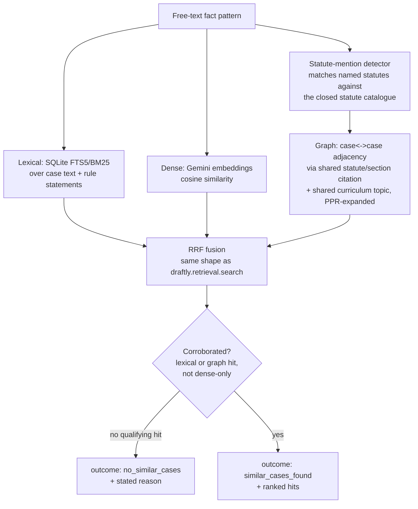

# Similar-Case Retrieval: Architecture and Test Results

Status: `unverified`. Grading below was produced by an LLM (Haiku) reading
retrieved excerpts, not by a lawyer — treat it as a development-time signal
about the retrieval pipeline's precision, not a legal-correctness claim.

## What this is

`draftly.case_retrieval` answers one question: given a free-text fact
pattern, which past cases in the conveyancing-flagged corpus are similar —
or is there genuinely nothing similar? It is a new package, kept separate
from the statutes-only `draftly.retrieval` engine (see that package's
`corpus.py` scope guards in `CLAUDE.md`) so that widening case-law coverage
never risks widening what the statute engine will answer from.

Population is fixed to the 5,121 of 9,177 cases already flagged
`conveyancing_match=true` in `data/processed/cases.jsonl` — an existing gate
(`scripts/classify_commonlii_convayancing_improved.py` and predecessors),
not a new classifier built for this feature.

## Architecture



| Stage | File |
| --- | --- |
| Conveyancing population + statute/topic bridge loading | `src/draftly/case_retrieval/corpus.py` |
| Fingerprinted BM25 index (lexical channel) | `src/draftly/case_retrieval/index.py` |
| Gemini dense embeddings, cached by fingerprint | `src/draftly/case_retrieval/embeddings.py` |
| Case-to-case graph (statute/topic bridge) + PPR expansion | `src/draftly/case_retrieval/graph.py` |
| RRF fusion + abstention | `src/draftly/case_retrieval/search.py` |
| CLI / API | `src/draftly/case_retrieval/__main__.py`, `/similar-cases` in `src/draftly/retrieval/api.py` |

### How "no similar cases" is decided

Dense cosine similarity alone is easy to fool with generic legal
boilerplate, so a hit is only returned if corroborated by the lexical or
graph channel — dense similarity is additive evidence, never sufficient
alone. Lexical corroboration itself requires at least 3 distinct query
tokens to actually appear in the case text (`MIN_LEXICAL_OVERLAP` in
`search.py`), not just any one OR-matched term — an earlier version of this
check (requiring only 1 overlapping token) let an off-domain physics query
("quantum entanglement in superconducting qubit arrays") through, because a
land-acquisition judgment happened to discuss "computing the **quantum** of
compensation." Raising the floor to 3 tokens fixed that specific case, but
this is a heuristic tuned against a handful of manual probes, not a
calibrated statistical threshold — no similar-case gold set exists to
calibrate against, and this project does not have one for this feature. It
is a measured, working boundary, not a solved one.

The dense channel was **not exercised** in this test run: no
`GEMINI_API_KEY` was configured in this environment, so
`embeddings.dense_lookup()` returned empty and every result below comes from
the lexical + graph channels only, exactly as the engine is designed to
degrade.

## Test set: 20 queries from past exam papers

`src/questions.md` holds 18 top-level questions (73 sub-parts) across two
Sri Lanka Law College Conveyancing past papers (April 2026, October 2025) —
none written as case-law queries. `scripts/similar-case-retrieval/build_test_set.py`
hand-selects 20 sub-parts that are fact-driven and case-law-answerable,
skipping pure arithmetic (stamp-duty calculations) and pure statutory-note
recitation, and favoring the topics densest in the corpus (partition,
prescription, notarial liability, deeds/gifts, succession). Each query
combines the sub-part's fact-pattern preamble with its specific question, so
`find_similar()` sees the kind of input a lawyer would actually submit.
Full list and selection rationale: `test_queries.jsonl`.

## Grading method

For each of the 20 queries, `find_similar()` was run (`run_eval.py`,
producing `evaluation/runs/similar-case-retrieval-v1/`), then **this
session (Sonnet) dispatched one independent Haiku subagent per query** —
each reading only that query's fact pattern, outcome, and retrieved hits
(no shared context between them), and returning one verdict from a fixed
five-way rubric: `relevant`, `partially_relevant`, `irrelevant`,
`correct_abstention`, `incorrect_abstention`. Sonnet aggregated the 20
verdicts below without altering any of them.

## Results

| Outcome | Count |
| --- | ---: |
| `relevant` | 2 |
| `partially_relevant` | 15 |
| `irrelevant` | 3 |
| `correct_abstention` | 0 |
| `incorrect_abstention` | 0 |
| **Total** | **20** |

All 20 queries returned `similar_cases_found` (no abstentions were
triggered by this particular set — every query was a real, detailed exam
fact pattern with substantial lexical overlap against the corpus, so this
test set does not exercise the abstention path; the earlier physics-query
probe during development did).

| # | Source | Verdict | Why |
| --- | --- | --- | --- |
| scr-01 | April 2026 Q1.1 | partially_relevant | Two of five hits (gift-revocability/succession cases) genuinely on-topic; three are unlabeled generic court headers. |
| scr-02 | April 2026 Q1.3 | partially_relevant | Three of five hits address intestate succession; none reach the Land (Restrictions on Alienation) Act specifically. |
| scr-03 | April 2026 Q3.2 | irrelevant | All five hits are administrative writs matched only on "Divisional Secretary"; none address LDO mortgage-approval doctrine. |
| scr-04 | April 2026 Q3.3 | partially_relevant | Two hits are genuine land-administration cases; three are unrelated litigation. |
| scr-05 | April 2026 Q3.4 | irrelevant | All hits are administrative land-official writs matched on "land"; none reach LDO Third Schedule succession doctrine. |
| scr-06 | April 2026 Q5.1 | partially_relevant | Two hits directly address Notaries Ordinance deed-execution authority; three are unrelated property disputes. |
| scr-07 | April 2026 Q5.4 | partially_relevant | One hit (Carthelis v. Ranasinghe) is highly on-point for notary duties; others are wills/trusts or place-name-only matches. |
| scr-08 | April 2026 Q6.3 | partially_relevant | Two hits directly address non-registration consequences; one is off-topic (Trust Receipts Ordinance). |
| scr-09 | April 2026 Q9.1 | partially_relevant | Two hits address will execution/estate administration; three are unrelated. |
| scr-10 | October 2025 Q1.1 | relevant | All five hits address fidei commissum, conditional gifts, and partition-decree devolution — the exact doctrine in play. |
| scr-11 | October 2025 Q2.2 | relevant | All five hits directly address Kandyan-law gift irrevocability and its statutory revocation procedure. |
| scr-12 | October 2025 Q3.1 | partially_relevant | One hit directly on point (Prevention of Frauds Ordinance + deed issues); three are unrelated filler. |
| scr-13 | October 2025 Q3.2 | partially_relevant | One hit addresses a notary attesting outside their own district; three are wills cases matched only on "notary". |
| scr-14 | October 2025 Q4.2 | partially_relevant | One hit addresses caveats under the Registration of Documents Ordinance; four are off-topic. |
| scr-15 | October 2025 Q5.3 | irrelevant | All five hits matched on generic property vocabulary; none address power-of-attorney scope (sale vs. lease). |
| scr-16 | October 2025 Q6.4 | partially_relevant | Four of five hits are unrelated fundamental-rights cases; one is plausibly on-topic for prescriptive rights. |
| scr-17 | October 2025 Q7.1 | partially_relevant | One hit addresses notary territorial jurisdiction directly; others are succession or generic property disputes. |
| scr-18 | October 2025 Q9.3 | partially_relevant | Two hits address guardian/curator authority over a minor's property directly; others are tangential. |
| scr-19 | October 2025 Q9.4 | partially_relevant | One hit addresses minors and property interests directly; others are procedural or only adjacent. |
| scr-20 | October 2025 Q9.5 | partially_relevant | One hit touches notarial duties; four are probate cases matched only on the word "Will". |

## Reading these results honestly

- **0/20 fully irrelevant-and-returned-nothing-useful, but only 2/20 fully
  relevant.** The dominant outcome (15/20) is `partially_relevant`: the
  fusion reliably surfaces at least one genuinely on-point precedent, but
  padding the result list to `limit=5` routinely pulls in lexically-matched
  but doctrinally unrelated cases (especially generic land-administration
  writs that share address/authority-name vocabulary with LDO questions, and
  wills cases that share only the word "notary" or "Will" with notarial-duty
  questions).
- **The 3 `irrelevant` cases share a pattern**: LDO/administrative-approval
  questions (scr-03, scr-05) and the power-of-attorney-scope question
  (scr-15) pull in cases that share institutional vocabulary (Divisional
  Secretary, land officials, "property") without sharing the actual legal
  question. These are exactly the false positives the lexical corroboration
  floor was built to catch during development (see the "quantum" probe
  above) — it caught the adversarial off-domain case, but not these
  same-domain-different-doctrine cases, which is a harder problem: the words
  are genuinely legally relevant, just not to the specific issue asked.
- **A smaller `limit` would likely raise precision** at the cost of recall
  — most of the genuinely on-topic hits above rank in position 1-2, and the
  padding cases arrive at positions 3-5. This project has not tuned that
  trade-off; it is reported here as a known lever, not applied.
- **No abstention was exercised by this test set.** Every one of the 20
  queries is a rich, detailed exam fact pattern that shares real vocabulary
  with the corpus, so none of them reached the `no_similar_cases` path.
  The abstention mechanism was validated separately during development
  (see `search.py`'s docstring and `tests/test_similar_case_retrieval.py`),
  not by this 20-query set.

## Reproducing this run

```bash
uv run python -m draftly.case_retrieval build
python scripts/similar-case-retrieval/build_test_set.py
uv run python scripts/similar-case-retrieval/run_eval.py
```

Outputs land in `evaluation/runs/similar-case-retrieval-v1/`
(`config.json`, `predictions.csv`, `metrics.json`). The per-query grading
JSON inputs used above are in `scripts/similar-case-retrieval/grading/`.
